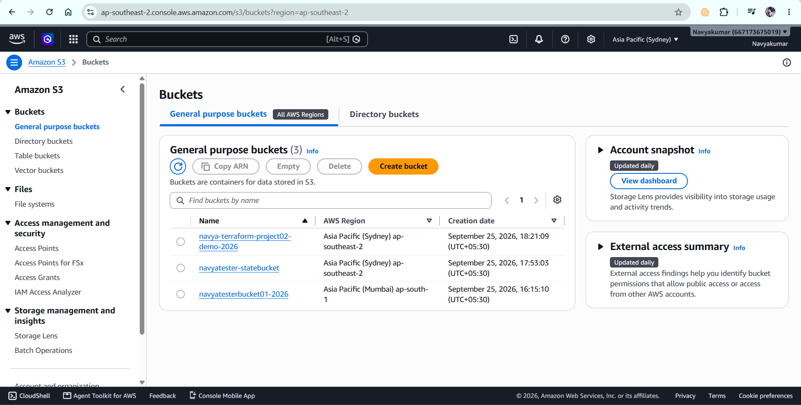
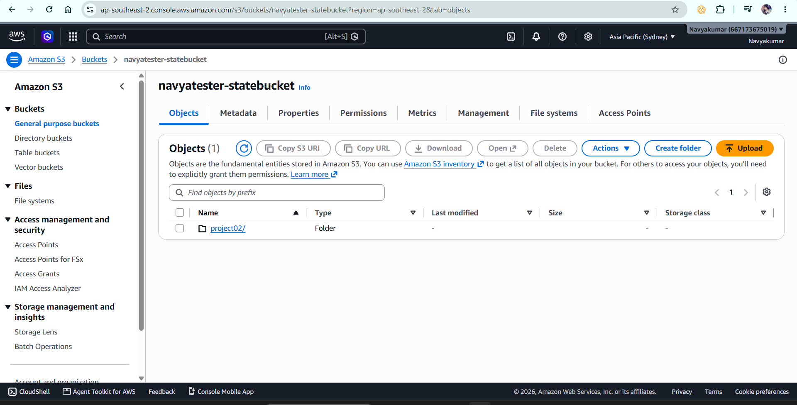
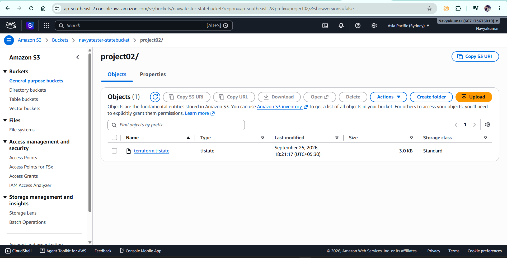

# Project 02 — Terraform Remote State with AWS S3



## 📌 Project Overview

This project demonstrates how to configure **Terraform Remote State using an Amazon S3 backend**.

In the previous project, Terraform used a local state file (`terraform.tfstate`) on the developer's machine.

In this project, Terraform state is stored remotely in an **Amazon S3 bucket**, allowing Terraform state to be centralized and shared instead of being maintained only on an individual machine.

The project also demonstrates **S3-based state locking** using Terraform's `use_lockfile = true` configuration.

---

## 🎯 Objectives

* Understand Terraform state
* Understand local state vs remote state
* Understand Terraform backends
* Configure an Amazon S3 backend
* Store Terraform state remotely
* Enable state encryption
* Enable S3-based state locking
* Understand the Terraform backend bootstrap requirement
* Verify Terraform state from the CLI
* Verify the remote state object from AWS S3
* Understand how remote state is useful in team and CI/CD environments

---

## 🏗️ Architecture

```text
                    Terraform
                        |
                        |
                 S3 Remote Backend
                        |
                        ▼
          ┌──────────────────────────┐
          │   S3 State Bucket        │
          │                          │
          │   project02/             │
          │      terraform.tfstate  │
          └──────────────────────────┘
                        |
                        |
                Stores Terraform
                     state
                        |
                        ▼
          ┌──────────────────────────┐
          │ AWS S3 Demo Bucket       │
          │                          │
          │ Managed by Terraform     │
          └──────────────────────────┘
```

---

# 📂 Project Structure

```text
02-remote-state-s3/
│
├── README.md
├── main.tf
└── .terraform.lock.hcl
```

Terraform automatically creates the `.terraform/` directory locally.

The Terraform state file is stored remotely in S3 and is **not committed to GitHub**.

---

# 🔐 What is Terraform State?

Terraform state is the information Terraform maintains about the infrastructure it manages.

Example:

```text
Terraform Configuration
        ↓
AWS Infrastructure
        ↓
Terraform State
```

Terraform uses the state to understand:

* Which resources it manages
* Resource IDs
* Resource attributes
* The relationship between configuration and real infrastructure
* What needs to be created, modified, or destroyed

---

# 💻 Local State vs Remote State

## Local State

By default, Terraform stores state locally:

```text
terraform.tfstate
```

Example:

```text
Developer Laptop
      |
      └── terraform.tfstate
```

This can become difficult when multiple developers or CI/CD pipelines need to work with the same infrastructure.

---

## Remote State

With remote state:

```text
Developer A ──┐
Developer B ──┼──> S3 Remote State
CI/CD ─────────┘
```

All authorized Terraform users and automation can work with the same centralized state.

---

# ☁️ Why Amazon S3?

Amazon S3 can be used as a Terraform backend to provide a centralized location for Terraform state.

Advantages include:

* Centralized state storage
* Team collaboration
* Encryption support
* Versioning support
* Integration with AWS infrastructure
* State locking support through Terraform's S3 backend locking mechanism

---

# ⚠️ Backend Bootstrap Problem

A Terraform backend bucket must already exist before Terraform can use it as its backend.

Therefore, the state bucket for this project was created **manually in AWS S3 first**.

The backend bucket is separate from the AWS resource managed by Terraform.

```text
Step 1
Create S3 state bucket manually
        ↓
Step 2
Configure S3 backend in Terraform
        ↓
Step 3
terraform init
        ↓
Step 4
Terraform manages infrastructure
        ↓
Step 5
Terraform state is stored remotely
```

The state bucket itself is not managed by this Terraform configuration.

---

# 📝 Terraform Configuration

The project uses an S3 backend:

```hcl
terraform {
  required_version = ">= 1.14.0, < 2.0.0"

  required_providers {
    aws = {
      source  = "hashicorp/aws"
      version = "~> 6.0"
    }
  }

  backend "s3" {
    bucket       = "navyatester-statebucket"
    key          = "project02/terraform.tfstate"
    region       = "ap-south-1"
    encrypt      = true
    use_lockfile = true
  }
}
```

AWS provider:

```hcl
provider "aws" {
  region = "ap-south-1"
}
```

Terraform-managed resource:

```hcl
resource "aws_s3_bucket" "demo" {
  bucket = "navya-terraform-project02-demo-2026"
}
```

---

# 🔎 Backend Configuration Explained

### `bucket`

```hcl
bucket = "navyatester-statebucket"
```

Specifies the S3 bucket where Terraform stores the remote state.

---

### `key`

```hcl
key = "project02/terraform.tfstate"
```

Specifies the location of the state object inside the S3 bucket.

The resulting S3 object is:

```text
project02/terraform.tfstate
```

---

### `region`

```hcl
region = "ap-south-1"
```

Specifies the AWS region containing the state bucket.

---

### `encrypt`

```hcl
encrypt = true
```

Enables encryption for the Terraform state stored in S3.

---

### `use_lockfile`

```hcl
use_lockfile = true
```

Enables Terraform's S3-based state locking mechanism.

State locking helps prevent multiple Terraform operations from modifying the same state simultaneously.

---

# 🛠️ Hands-on Implementation

## Step 1 — Create the S3 State Bucket

A dedicated S3 bucket was created manually in AWS.

Purpose:

```text
Store Terraform remote state
```

This bucket is different from the S3 bucket managed by Terraform.

---

## Step 2 — Configure the Backend

The S3 backend was added to `main.tf`.

```hcl
backend "s3" {
  bucket       = "navyatester-statebucket"
  key          = "project02/terraform.tfstate"
  region       = "ap-south-1"
  encrypt      = true
  use_lockfile = true
}
```

---

## Step 3 — Initialize Terraform

Command:

```bash
terraform init
```

Terraform successfully configured the S3 backend.

Expected message:

```text
Terraform has been successfully initialized!
```

---

## Step 4 — Reconfigure the Backend

During development, the backend configuration was corrected.

Terraform reported:

```text
Error: Backend configuration changed
```

Since this was a new project and there was no existing state that needed to be migrated, the backend was reconfigured using:

```bash
terraform init -reconfigure
```

This instructed Terraform to use the current backend configuration.

---

## Step 5 — Format and Validate

Commands:

```bash
terraform fmt
```

and:

```bash
terraform validate
```

Validation confirmed that the Terraform configuration was valid.

---

## Step 6 — Create the Terraform Resource

The following S3 bucket was managed through Terraform:

```hcl
resource "aws_s3_bucket" "demo" {
  bucket = "navya-terraform-project02-demo-2026"
}
```

Terraform created the resource in AWS.

---

## Step 7 — Check Terraform State

Command:

```bash
terraform state list
```

The resource appears as:

```text
aws_s3_bucket.demo
```

This confirms that Terraform is tracking the resource.

---

## Step 8 — Verify Remote State

The remote state is stored in the S3 backend:

```text
navyatester-statebucket
└── project02/
    └── terraform.tfstate
```

The important point is that the state is stored in the configured S3 backend rather than being maintained only as a local Terraform state file.

---

# 🔄 Important Terraform Commands Learned

| Command                           | Purpose                                          |
| --------------------------------- | ------------------------------------------------ |
| `terraform init`                  | Initializes Terraform and configures the backend |
| `terraform init -reconfigure`     | Reconfigures the backend                         |
| `terraform fmt`                   | Formats Terraform configuration                  |
| `terraform validate`              | Validates Terraform configuration                |
| `terraform plan`                  | Shows proposed infrastructure changes            |
| `terraform apply`                 | Creates or modifies infrastructure               |
| `terraform state list`            | Lists resources tracked in state                 |
| `terraform state show <resource>` | Shows detailed state information                 |
| `terraform state pull`            | Retrieves the current state                      |

---

# 🔐 State Security

Terraform state can contain sensitive infrastructure information.

Therefore:

```text
terraform.tfstate
terraform.tfstate.backup
```

should **not** be committed to GitHub.

The repository `.gitignore` excludes Terraform state files.

The `.terraform/` directory is also excluded because it contains local Terraform working files.

---

# 📄 Terraform Lock File

Terraform created:

```text
.terraform.lock.hcl
```

This file records provider selections and checksums.

It should be committed to Git because it helps Terraform consistently use the selected provider versions.

---

# 🚀 DevOps / DevSecOps Relevance

Remote state is important in real DevOps and DevSecOps environments.

A typical workflow can look like:

```text
Developer
    |
    ▼
Git Repository
    |
    ▼
CI/CD Pipeline
    |
    ▼
Terraform
    |
    ▼
AWS Infrastructure
    |
    ▼
S3 Remote State
```

Instead of every developer maintaining an independent state file, the team can use a centralized remote backend.

This becomes especially important when Terraform is executed through CI/CD pipelines.

---

# 🎯 Interview Questions

### 1. What is Terraform state?

Terraform state is the record Terraform uses to track the infrastructure resources it manages and their attributes.

### 2. What is remote state?

Remote state means storing Terraform state in a centralized backend such as Amazon S3 instead of storing it only on the local machine.

### 3. Why use remote state?

Remote state provides centralized state management and allows teams and automation such as CI/CD pipelines to work with the same Terraform state.

### 4. Why can't Terraform create its own S3 backend bucket in the same configuration?

The backend must be available before Terraform initializes and can use that backend to store state. This creates a bootstrap requirement.

### 5. What is state locking?

State locking prevents conflicting Terraform operations from modifying the same state at the same time.

### 6. What is the purpose of `terraform init`?

`terraform init` initializes the Terraform working directory, downloads required providers and modules, and configures the backend.

### 7. What does `terraform init -reconfigure` do?

It tells Terraform to reconfigure the current backend rather than attempting to migrate existing state.

### 8. Should `terraform.tfstate` be committed to Git?

No. Terraform state should generally not be committed to source control because it can contain sensitive infrastructure information.

### 9. Should `.terraform.lock.hcl` be committed?

Yes. It records provider selections and checksums and should normally be committed to version control.

### 10. What is the difference between a backend and a provider?

A **backend** determines where Terraform stores its state.

A **provider** allows Terraform to communicate with an infrastructure platform such as AWS.

Example:

```text
S3 backend
    ↓
Stores Terraform state

AWS provider
    ↓
Communicates with AWS resources
```

---

# 🧠 Key Learnings

Through this project I learned:

* Terraform state management
* Local vs remote state
* Terraform backend configuration
* Amazon S3 backend
* Backend bootstrap requirements
* S3 state storage
* State encryption
* S3-based state locking
* Backend reconfiguration
* Terraform state commands
* Terraform provider lock files
* Terraform state security
* Remote state in team environments
* Remote state in CI/CD workflows

---

# 📌 Project Status

```text
✅ S3 state bucket created
✅ S3 backend configured
✅ Terraform initialized
✅ AWS provider configured
✅ Terraform resource created
✅ Terraform state verified
✅ Remote state stored in S3
✅ State locking configured
```

---

## 🔜 Next Project

The next project will build on these Terraform fundamentals and introduce additional concepts such as:

* Variables
* Outputs
* Reusable configuration
* Infrastructure organization
* Terraform best practices
