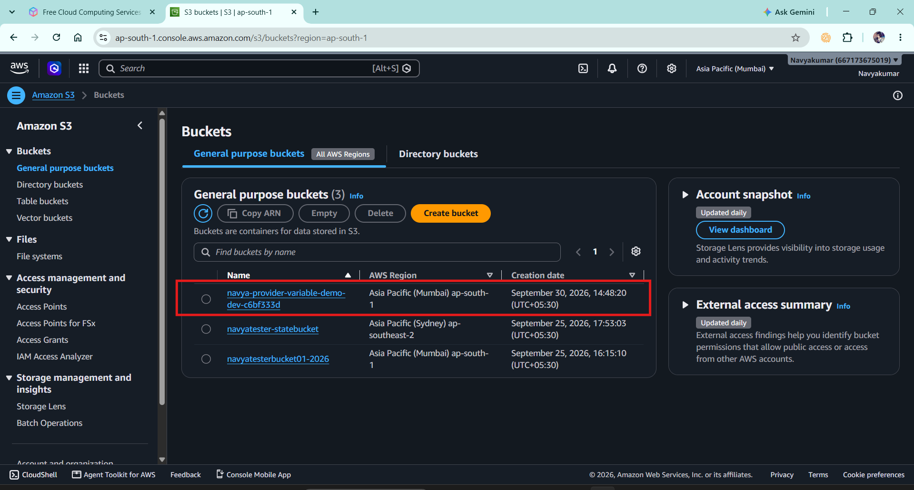
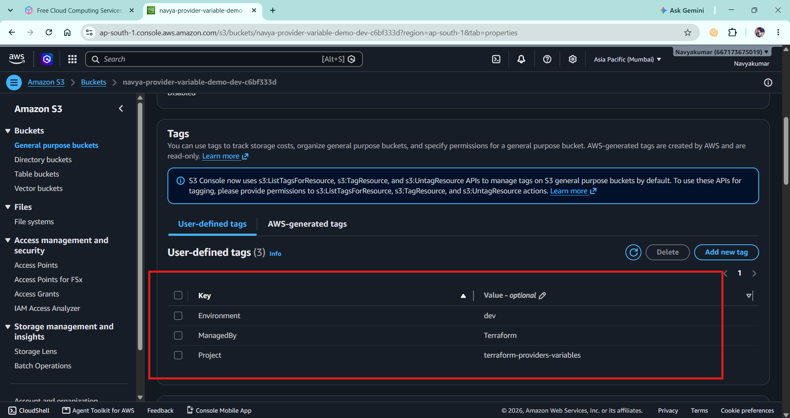
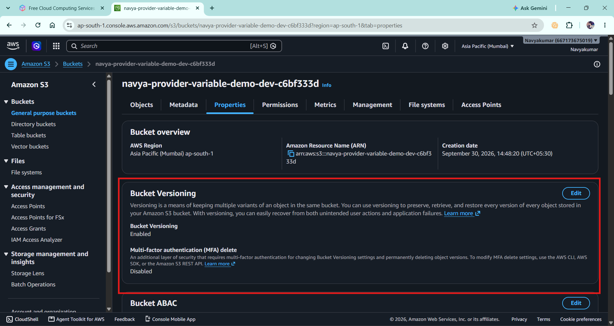

# Project 03 - Terraform Providers and Variables

## 📌 Project Overview

This project demonstrates how to use Terraform providers, provider
version constraints, provider aliases, input variables, local values,
expressions, outputs, and Terraform variable files.

The project creates an AWS S3 bucket using Terraform.

The purpose of this project is not only to create an AWS resource,
but to understand how Terraform configurations can be made reusable
and configurable instead of hardcoding values directly inside
resource blocks.

---

# 🏗️ Architecture

```text
                    Terraform
                        |
        +---------------+---------------+
        |                               |
   AWS Provider                   Random Provider
        |                               |
        |                        Generates unique
        |                        bucket suffix
        |                               |
        +---------------+---------------+
                        |
                     S3 Bucket
                        |
              +---------+---------+
              |                   |
           Variables            Locals
              |                   |
        region/name/etc.      tags/prefix
              |
              v
        S3 Bucket Resource
        03-providers-and-variables/

├── providers.tf
├── variables.tf
├── locals.tf
├── main.tf
├── outputs.tf
├── terraform.tfvars
├── .gitignore
└── README.md
md
📄 File Explanation
1. providers.tf

This file contains the Terraform version requirement and
provider configuration.

It contains:

Terraform CLI version constraint
AWS provider
Random provider
AWS provider alias
Provider version constraints

Example:

terraform {
  required_version = ">= 1.14.0, < 2.0.0"

  required_providers {
    aws = {
      source  = "hashicorp/aws"
      version = "~> 6.0"
    }

    random = {
      source  = "hashicorp/random"
      version = "~> 3.7"
    }
  }
}
AWS Provider

The AWS provider allows Terraform to communicate with AWS and
create/manage AWS resources.

provider "aws" {
  region = var.aws_region
}

The AWS region is taken from an input variable instead of being
hardcoded.

Provider Alias

The project also demonstrates an AWS provider alias.

provider "aws" {
  alias  = "secondary"
  region = var.secondary_region
}

This demonstrates that Terraform can have multiple configurations
of the same provider.

For example:

Default AWS Provider
        |
   ap-south-1

Secondary AWS Provider
        |
   us-east-1

The secondary provider is included to demonstrate provider aliasing.
The S3 resource in this project uses the default AWS provider.

2. variables.tf

This file declares the input variables used by the project.

The project demonstrates:

String variables
Boolean variables
Default values
Variable descriptions
Variable references

Example:

variable "aws_region" {
  description = "Primary AWS region"
  type        = string
  default     = "ap-south-1"
}

Another example:

variable "enable_versioning" {
  description = "Enable S3 bucket versioning"
  type        = bool
  default     = true
}
3. locals.tf

This file contains local values.

Locals are useful when we want to calculate or reuse values inside
the Terraform configuration.

Example:

locals {
  common_tags = {
    Project     = var.project_name
    Environment = var.environment
    ManagedBy   = "Terraform"
  }

  bucket_prefix = "${var.bucket_name}-${var.environment}"
}

The bucket_prefix uses variables.

For example:

bucket_name = navya-provider-variable-demo
environment = dev

Terraform creates:

navya-provider-variable-demo-dev
4. main.tf

This file contains the main resources.

Random ID

The Random provider generates a unique suffix.

resource "random_id" "bucket_suffix" {
  byte_length = 4
}

For example:

a82f91c3

This is used to make the S3 bucket name unique.

Main AWS Resource

The main AWS resource in this project is:

resource "aws_s3_bucket" "demo"

It creates an S3 bucket.

The bucket name is generated using:

bucket = "${local.bucket_prefix}-${random_id.bucket_suffix.hex}"

For example:

navya-provider-variable-demo-dev-a82f91c3

This demonstrates how Terraform can combine:

Input Variable
      +
Local Value
      +
Random Provider
      =
Dynamic Resource Configuration
S3 Versioning

The project also configures versioning for the same S3 bucket.

resource "aws_s3_bucket_versioning" "demo" {

  bucket = aws_s3_bucket.demo.id

  versioning_configuration {
    status = var.enable_versioning ? "Enabled" : "Suspended"
  }
}

This demonstrates a Terraform conditional expression.

The syntax is:

condition ? value_if_true : value_if_false

Therefore:

enable_versioning = true
        ↓
Enabled

and:

enable_versioning = false
        ↓
Suspended
5. outputs.tf

This file defines values that Terraform displays after the
infrastructure is created.

The project outputs:

S3 bucket name
S3 bucket ARN
AWS region
Environment

Example:

output "bucket_name" {
  description = "Name of the created S3 bucket"
  value       = aws_s3_bucket.demo.bucket
}

After applying the configuration:

terraform output

can be used to display these values.

6. terraform.tfvars

This file provides actual values for the input variables.

Example:

aws_region       = "ap-south-1"
secondary_region = "us-east-1"

bucket_name = "navya-provider-variable-demo"

environment = "dev"

project_name = "terraform-providers-variables"

enable_versioning = true

Terraform automatically loads values from terraform.tfvars.

7. .gitignore

The .gitignore file prevents Terraform-generated files and
potentially sensitive variable files from being committed.

Examples:

.terraform/
*.tfstate
*.tfstate.*
terraform.tfvars
terraform.exe

The Terraform state file should not normally be committed to Git.

🔑 Important Learning: Variables

One important challenge I faced while building this project was
understanding how Terraform variables actually work.

Initially, I declared:

variable "bucket_name" {
  type = string
}

and provided:

bucket_name = "navya-provider-variable-demo"

in terraform.tfvars.

However, simply declaring a variable does not mean Terraform
automatically uses it.

The variable must be referenced somewhere in the Terraform
configuration.

For example:

var.bucket_name

I initially noticed that bucket_name was not being referenced
inside the resource configuration.

I corrected this by using the variable inside locals.tf:

locals {
  bucket_prefix = "${var.bucket_name}-${var.environment}"
}

Then the local value was used in main.tf:

bucket = "${local.bucket_prefix}-${random_id.bucket_suffix.hex}"

This helped me understand the complete flow:

terraform.tfvars
       |
       v
Input Variable
       |
       v
var.bucket_name
       |
       v
Local Value
       |
       v
S3 Resource
Key takeaway

Declaring a variable does not automatically make Terraform use it.
The variable must be referenced using var.variable_name.

🔄 Terraform Workflow Used

The project follows the standard Terraform workflow:

Write Configuration
        |
        v
terraform init
        |
        v
terraform fmt
        |
        v
terraform validate
        |
        v
terraform plan
        |
        v
terraform apply
        |
        v
Verify AWS Resource
        |
        v
terraform output
        |
        v
terraform destroy

Did you use any Terraform functions in your project?

You can answer:

"Yes. I used Terraform's built-in lower() function to convert the dynamically constructed S3 bucket name prefix to lowercase. This is useful because S3 bucket names must follow lowercase naming requirements. I combined the bucket_name and environment variables and passed the resulting string to lower()."

The actual function is:

lower("${var.bucket_name}-${var.environment}")
terraform.tfvars
       ↓
bucket_name = "Navya-Provider-Demo"
environment = "DEV"
       ↓
local.bucket_prefix
       ↓
lower()
       ↓
"navya-provider-demo-dev"
       ↓
random suffix
       ↓
navya-provider-demo-dev-a82f91c3
       ↓
S3 bucket
💼 Interview Explanation

If an interviewer asks:

"Explain your Terraform project."

I would explain it as:

"I created a Terraform project to understand provider
configuration and reusable infrastructure using variables.

I configured the AWS and Random providers with version
constraints and also demonstrated an AWS provider alias for a
secondary region.

I used input variables for values such as the AWS region,
environment, project name, bucket name, and S3 versioning.

I used locals to create reusable tags and construct the S3
bucket name.

The main AWS resource is an S3 bucket. The Random provider
generates a unique suffix so that the bucket name is unique.

I also used a conditional expression to enable or suspend S3
versioning based on an input variable.

Finally, I defined outputs for the bucket name, ARN, region, and
environment and followed the Terraform workflow of init, fmt,
validate, plan, apply, output, and destroy."

🎤 Interview Questions and Answers
Q1. What is a Terraform provider?

Answer:

A provider is a plugin that allows Terraform to interact with
an external platform or service. For example, the AWS provider
allows Terraform to create and manage AWS resources.

Q2. Which providers did you use?

Answer:

I used the HashiCorp AWS provider to manage the S3 bucket and
the Random provider to generate a unique suffix for the bucket
name.

Q3. Why did you use the Random provider?

Answer:

S3 bucket names must be globally unique. I used the Random
provider to generate a unique hexadecimal suffix and appended
it to the bucket name.

Q4. What is a provider alias?

Answer:

A provider alias allows me to create multiple configurations
of the same provider. For example, I configured one AWS
provider for ap-south-1 and another aliased provider called
secondary for us-east-1.

Q5. What is an input variable?

Answer:

An input variable allows us to pass values into a Terraform
configuration instead of hardcoding those values inside
resources. It makes the configuration reusable.

Q6. What variable types did you use?

Answer:

I used string and bool variables in this project. For
example, AWS region and bucket name are strings, while
enable_versioning is a boolean.

Q7. What is the difference between a variable and a local?

Answer:

An input variable receives values from outside the Terraform
configuration, while a local value is calculated or defined
inside the Terraform configuration for reuse.

Example:

Variable
External input
      ↓
var.bucket_name

Local
Calculated/reusable value
      ↓
local.bucket_prefix
Q8. What is terraform.tfvars?

Answer:

terraform.tfvars is a variable definition file used to
provide actual values for input variables declared in
variables.tf.

Q9. Does declaring a variable mean Terraform automatically uses it?

Answer:

No. Declaring a variable only defines it. Terraform uses the
variable only when it is referenced, for example
var.bucket_name.

This was an important learning point in this project.

Q10. What is a local value?

Answer:

A local value is a named expression inside Terraform that can
be reused within the configuration. I used locals to create
common tags and construct the S3 bucket name prefix.

Q11. What is an output?

Answer:

An output exposes useful information from Terraform after
resources are created. In my project I output the S3 bucket
name, ARN, region, and environment.

Q12. What is ~> 6.0?

Answer:

It is a pessimistic version constraint. In this project it
allows compatible AWS provider versions within the 6.x series
rather than allowing Terraform to move to an incompatible
major version such as 7.x.

Q13. What is the difference between Terraform version and provider version?

Answer:

The Terraform version constraint controls the Terraform CLI
version that can execute the configuration. The provider
version constraint controls the version of the provider plugin
Terraform can use.

Q14. What is .terraform.lock.hcl?

Answer:

It records selected provider versions and checksums. It helps
ensure consistent provider installations across different
environments.

Q15. Why do we commit .terraform.lock.hcl?

Answer:

We commit the lock file so team members and CI/CD environments
can use the same verified provider versions and checksums.

Q16. Why should we not commit Terraform state files?

Answer:

Terraform state can contain infrastructure information and
sometimes sensitive values. It should be protected and usually
stored in a secure remote backend for team environments.

Q17. What is a conditional expression in Terraform?

Answer:

A conditional expression selects one of two values based on a
condition.

Example:

var.enable_versioning ? "Enabled" : "Suspended"

If the variable is true, Terraform selects Enabled;
otherwise it selects Suspended.

Q18. What happens during terraform init?

Answer:

Terraform initializes the working directory, downloads the
required providers, initializes the backend if configured, and
creates or updates the dependency lock file.

Q19. What is the difference between terraform plan and terraform apply?

Answer:

terraform plan previews the changes Terraform intends to make.
terraform apply actually makes those changes to the target
infrastructure.

Q20. How would you make this project production-ready?

Answer:

I would use a remote backend for state management, secure state
access, reusable modules, separate environments, CI/CD
validation, security scanning such as Checkov, and proper
IAM least-privilege permissions.


