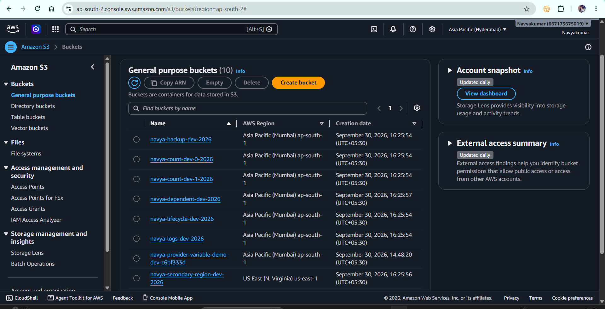

# Terraform Meta-Arguments, Multi-Region & Multi-Account

## 📌 Project Overview

This project demonstrates how Terraform can manage AWS infrastructure using:

* Multiple AWS provider configurations
* Multi-region deployment
* Multi-account provider configuration
* `count`
* `for_each`
* `depends_on`
* `lifecycle`
* Variables
* Resource addressing
* Terraform state

The project uses Amazon S3 because it is simple, low-cost for an empty lab, and allows the Terraform concepts to be demonstrated without building a large infrastructure stack.

---

# 🏗️ Project Architecture

```text
                         Terraform
                             |
                 +-----------+-----------+
                 |                       |
          AWS Provider              AWS Provider
          Default                  alias = secondary
                 |                       |
          ap-south-1                 us-east-1
                 |                       |
       +---------+---------+             |
       |         |         |             |
      count   for_each  depends_on    S3 Bucket
       |         |         |
       +---------+---------+
                 |
          lifecycle bucket


          AWS Provider
        alias = secondary_account
                 |
          Secondary AWS Account
          via AssumeRole
```

---

# 📁 Project Structure

```text
04-meta-arguments/
│
├── providers.tf
├── variables.tf
├── main.tf
├── outputs.tf
├── terraform.tfvars
├── .gitignore
└── README.md
```

---

# 📄 File-by-File Explanation

## 1. `providers.tf`

### Purpose

`providers.tf` defines the Terraform version and AWS provider configuration.

This project demonstrates three AWS provider configurations:

1. Primary AWS account in `ap-south-1`
2. Same AWS account in `us-east-1`
3. Secondary AWS account using `assume_role`

### Primary provider

```hcl
provider "aws" {
  region = var.primary_region
}
```

This is the default AWS provider.

Resources that do not specify another provider automatically use this configuration.

For example:

```hcl
resource "aws_s3_bucket" "count_demo" {
  ...
}
```

uses the default provider.

---

### Secondary-region provider

```hcl
provider "aws" {
  alias  = "secondary"
  region = var.secondary_region
}
```

The `alias` creates another configuration of the AWS provider.

We can use it like:

```hcl
provider = aws.secondary
```

Therefore:

```hcl
resource "aws_s3_bucket" "secondary_region" {
  provider = aws.secondary

  bucket = "navya-secondary-region-dev-2026"
}
```

is created using the `us-east-1` provider.

### Interview explanation

> "I used provider aliases to configure multiple AWS regions. The default AWS provider points to `ap-south-1`, while the aliased `secondary` provider points to `us-east-1`. A resource can select the required provider using `provider = aws.secondary`."

---

## Multi-Account Provider

The project also contains:

```hcl
provider "aws" {
  alias  = "secondary_account"
  region = var.primary_region

  assume_role {
    role_arn = var.secondary_account_role_arn
  }
}
```

This represents access to another AWS account.

The idea is:

```text
Account A
Terraform
   |
   | AssumeRole
   ↓
Account B
```

The IAM role must exist in the secondary account and must trust the identity from the first account.

### Important

The provider configuration demonstrates the cross-account setup.

Actual deployment into the second account requires:

* A second AWS account
* An IAM role in that account
* A correct trust policy
* Permission for the Terraform identity to assume the role

### Interview explanation

> "For multi-account deployment, I can define another AWS provider alias and use `assume_role` to access a role in another AWS account. This avoids hardcoding separate credentials into the Terraform configuration."

---

# 2. `variables.tf`

This file contains reusable input variables.

Example:

```hcl
variable "primary_region" {
  description = "Primary AWS region"
  type        = string
  default     = "ap-south-1"
}
```

Instead of hardcoding:

```hcl
region = "ap-south-1"
```

we use:

```hcl
region = var.primary_region
```

This makes the configuration reusable.

---

## Important variables

### `primary_region`

Controls the default AWS provider region.

```hcl
variable "primary_region" {
  type    = string
  default = "ap-south-1"
}
```

### `secondary_region`

Controls the aliased provider region.

```hcl
variable "secondary_region" {
  type    = string
  default = "us-east-1"
}
```

### `bucket_count`

Controls how many resources are created using `count`.

```hcl
variable "bucket_count" {
  type    = number
  default = 2
}
```

### `bucket_names`

Provides the collection used by `for_each`.

```hcl
variable "bucket_names" {
  type = set(string)

  default = [
    "logs",
    "backup"
  ]
}
```

---

# 3. `terraform.tfvars`

This file provides values for the input variables.

Example:

```hcl
primary_region   = "ap-south-1"
secondary_region = "us-east-1"

bucket_count = 2

bucket_names = [
  "logs",
  "backup"
]

environment  = "dev"
project_name = "terraform-meta-arguments"
```

Terraform automatically loads values from:

```text
terraform.tfvars
```

### Why use variables?

Instead of modifying Terraform resource code, we can change the input values.

For example:

```hcl
bucket_count = 2
```

can become:

```hcl
bucket_count = 3
```

without modifying the resource block.

---

# 4. `main.tf`

This is the main infrastructure configuration.

It contains the resources used to demonstrate the meta-arguments.

---

# 🔹 Meta-Argument 1: `count`

## What is `count`?

`count` is a Terraform meta-argument used to create multiple instances of the same resource.

Example:

```hcl
resource "aws_s3_bucket" "count_demo" {
  count = var.bucket_count

  bucket = "navya-count-${var.environment}-${count.index}-2026"
}
```

If:

```hcl
bucket_count = 2
```

Terraform creates:

```text
aws_s3_bucket.count_demo[0]
aws_s3_bucket.count_demo[1]
```

---

## `count.index`

`count.index` provides the numeric index of the resource instance.

For two resources:

```text
count.index = 0
count.index = 1
```

Therefore:

```hcl
bucket = "navya-count-${count.index}"
```

produces different bucket names.

---

## When would I use `count`?

Use `count` when resources are nearly identical and you want to control the number of instances.

Example:

```text
3 EC2 instances
5 S3 buckets
2 test servers
```

---

# 🔹 Meta-Argument 2: `for_each`

## What is `for_each`?

`for_each` creates multiple resource instances from a collection.

Our project uses:

```hcl
resource "aws_s3_bucket" "foreach_demo" {
  for_each = var.bucket_names

  bucket = "navya-${each.key}-${var.environment}-2026"
}
```

Our input is:

```hcl
bucket_names = [
  "logs",
  "backup"
]
```

Terraform creates:

```text
aws_s3_bucket.foreach_demo["logs"]
aws_s3_bucket.foreach_demo["backup"]
```

---

## `each.key`

`each.key` represents the current key.

Example:

```hcl
bucket = "navya-${each.key}-dev-2026"
```

For `logs`:

```text
navya-logs-dev-2026
```

For `backup`:

```text
navya-backup-dev-2026
```

---

## `each.value`

`each.value` represents the value associated with the current key.

It is especially useful with maps.

Example:

```hcl
variable "buckets" {
  type = map(string)

  default = {
    logs   = "logs-bucket"
    backup = "backup-bucket"
  }
}
```

Then:

```hcl
for_each = var.buckets
```

allows:

```hcl
each.key
each.value
```

---

# `count` vs `for_each`

| `count`                      | `for_each`                             |
| ---------------------------- | -------------------------------------- |
| Uses a number                | Uses a collection                      |
| Uses numeric index           | Uses key/value                         |
| `count.index`                | `each.key` / `each.value`              |
| Good for identical instances | Good for uniquely identified instances |
| Address uses `[0]`, `[1]`    | Address uses `["key"]`                 |

Example:

```text
count:

aws_s3_bucket.demo[0]
aws_s3_bucket.demo[1]
```

versus:

```text
for_each:

aws_s3_bucket.demo["logs"]
aws_s3_bucket.demo["backup"]
```

---

# 🔹 Meta-Argument 3: `depends_on`

## What is `depends_on`?

`depends_on` creates an explicit dependency between Terraform resources.

Our project contains:

```hcl
resource "aws_s3_bucket" "dependent_demo" {
  bucket = "navya-dependent-dev-2026"

  depends_on = [
    aws_s3_bucket.count_demo
  ]
}
```

This tells Terraform:

```text
count_demo resources
       ↓
dependent_demo
```

Terraform waits for the specified dependency before creating the dependent resource.

---

## Why use `depends_on`?

Terraform normally creates dependencies automatically when one resource references another.

For example:

```hcl
bucket = aws_s3_bucket.demo.id
```

automatically creates a dependency.

Therefore, `depends_on` should generally be used when Terraform cannot infer a dependency automatically.

### Interview answer

> "`depends_on` is used to create an explicit dependency between resources when Terraform cannot determine the dependency from resource references. Terraform will wait for the dependency before creating or modifying the dependent resource."

---

# 🔹 Meta-Argument 4: `lifecycle`

`lifecycle` controls how Terraform handles changes to resources.

Our project demonstrates:

```hcl
lifecycle {
  create_before_destroy = true

  ignore_changes = [
    tags
  ]
}
```

---

# `create_before_destroy`

Normally, when a resource must be replaced, Terraform may need to:

```text
Destroy old resource
        ↓
Create new resource
```

With:

```hcl
create_before_destroy = true
```

Terraform attempts:

```text
Create replacement
        ↓
Destroy old resource
```

### Why?

This can reduce downtime for resources where replacement is required.

### Important limitation

Not every resource or situation can safely use this behavior.

For example, some resources have unique-name constraints.

---

# `prevent_destroy`

This protects a resource from being destroyed by Terraform.

Example:

```hcl
lifecycle {
  prevent_destroy = true
}
```

If Terraform attempts to destroy the resource, Terraform stops with an error.

This can be useful for critical infrastructure such as:

```text
Production databases
Critical storage
Important infrastructure
```

### Interview answer

> "`prevent_destroy` is a lifecycle setting that prevents Terraform from destroying a resource through Terraform configuration. It is useful as a protection mechanism for critical resources."

---

# `ignore_changes`

Our project uses:

```hcl
lifecycle {
  ignore_changes = [
    tags
  ]
}
```

This tells Terraform to ignore changes to the specified attribute when comparing the configuration with the current resource.

For example, if tags are changed outside Terraform, Terraform will not attempt to reconcile those tag changes.

### Important caution

`ignore_changes` should be used carefully.

If Terraform configuration changes the ignored attribute, Terraform will also ignore that change.

### Interview answer

> "`ignore_changes` tells Terraform to ignore changes to specified resource attributes during planning. It can be useful when certain attributes are intentionally managed outside Terraform."

---

# 🔹 Multi-Region

The project uses:

```hcl
provider "aws" {
  region = var.primary_region
}
```

and:

```hcl
provider "aws" {
  alias  = "secondary"
  region = var.secondary_region
}
```

Then the resource explicitly selects the secondary provider:

```hcl
resource "aws_s3_bucket" "secondary_region" {
  provider = aws.secondary

  bucket = "navya-secondary-region-dev-2026"
}
```

Therefore:

```text
Default provider
      ↓
ap-south-1
      ↓
Primary resources


aws.secondary
      ↓
us-east-1
      ↓
Secondary-region resource
```

---

# 🔹 Multi-Account

Multi-account Terraform works by creating different provider configurations.

Example:

```hcl
provider "aws" {
  alias  = "secondary_account"

  region = var.primary_region

  assume_role {
    role_arn = var.secondary_account_role_arn
  }
}
```

A resource can then use:

```hcl
provider = aws.secondary_account
```

This allows Terraform to operate in another AWS account using an IAM role.

### Recommended authentication approach

Do not hardcode:

```hcl
access_key = "..."
secret_key = "..."
```

Instead use AWS's credential chain and/or IAM role assumption.

---

# 📄 `outputs.tf`

Outputs display useful information after Terraform creates resources.

Example:

```hcl
output "count_buckets" {
  value = [
    for bucket in aws_s3_bucket.count_demo :
    bucket.bucket
  ]
}
```

This displays the buckets created by `count`.

Similarly:

```hcl
output "foreach_buckets" {
  value = [
    for bucket in aws_s3_bucket.foreach_demo :
    bucket.bucket
  ]
}
```

displays the buckets created by `for_each`.

---

# 🔎 Terraform Resource Addresses

This is an important interview topic.

For `count`:

```text
aws_s3_bucket.count_demo[0]
aws_s3_bucket.count_demo[1]
```

For `for_each`:

```text
aws_s3_bucket.foreach_demo["logs"]
aws_s3_bucket.foreach_demo["backup"]
```

Terraform uses these addresses to identify individual resource instances in state.

You can inspect them using:

```bash
terraform state list
```

---

# 🔄 Terraform Workflow Used

```text
Write Terraform configuration
          ↓
terraform init
          ↓
Download providers
          ↓
terraform fmt
          ↓
Format configuration
          ↓
terraform validate
          ↓
Validate syntax/configuration
          ↓
terraform plan
          ↓
Preview changes
          ↓
terraform apply
          ↓
Create/update AWS resources
          ↓
Terraform state
```

Commands used:

```bash
terraform init
terraform fmt
terraform validate
terraform plan
terraform apply
terraform state list
terraform output
terraform destroy
```

---

# 🎯 Hands-On Experiments

## Experiment 1 — Increase `count`

Change:

```hcl
bucket_count = 2
```

to:

```hcl
bucket_count = 3
```

Run:

```bash
terraform plan
```

Terraform should identify the additional instance:

```text
aws_s3_bucket.count_demo[2]
```

---

## Experiment 2 — Add a `for_each` item

Change:

```hcl
bucket_names = [
  "logs",
  "backup"
]
```

to:

```hcl
bucket_names = [
  "logs",
  "backup",
  "archive"
]
```

Run:

```bash
terraform plan
```

Terraform should add:

```text
aws_s3_bucket.foreach_demo["archive"]
```

---

## Experiment 3 — `prevent_destroy`

Temporarily add:

```hcl
prevent_destroy = true
```

inside the lifecycle block.

Run:

```bash
terraform destroy
```

Terraform should prevent destruction of the protected resource.

Remove the setting afterward before final cleanup.

---

# 🎤 Interview Questions & Answers

## Q1. What are Terraform meta-arguments?

### Answer

> "Meta-arguments are special arguments supported by Terraform resource and module blocks that control how Terraform manages resources. Common examples are `count`, `for_each`, `depends_on`, and `lifecycle`."

---

## Q2. What is `count`?

### Answer

> "`count` allows me to create multiple instances of a resource based on a numeric value. Each instance is identified using a numeric index available through `count.index`."

Example:

```hcl
count = 3
```

creates:

```text
resource[0]
resource[1]
resource[2]
```

---

## Q3. What is `for_each`?

### Answer

> "`for_each` creates multiple resource instances from a collection such as a map or set. It provides `each.key` and `each.value`, which makes it useful when each resource needs a meaningful identity."

---

## Q4. `count` vs `for_each`?

### Answer

> "I use `count` when I mainly need a number of similar resources. I prefer `for_each` when resources have meaningful individual keys or values because the resource instances are identified by those keys."

---

## Q5. What happens if you remove an item from `for_each`?

### Answer

Terraform identifies the specific resource instance associated with that key and plans to remove it.

For example:

```text
aws_s3_bucket.foreach_demo["backup"]
```

If `backup` is removed from the collection, Terraform plans to destroy that instance.

---

## Q6. What is `depends_on`?

### Answer

> "`depends_on` creates an explicit dependency between resources. It tells Terraform that one resource depends on another when the dependency cannot be inferred automatically from resource references."

---

## Q7. Does Terraform always need `depends_on`?

### Answer

> "No. Terraform automatically builds a dependency graph when resource references create dependencies. I use `depends_on` mainly for dependencies that Terraform cannot infer automatically."

---

## Q8. What is `lifecycle`?

### Answer

> "`lifecycle` is a meta-argument that controls how Terraform manages resource changes. It provides options such as `create_before_destroy`, `prevent_destroy`, and `ignore_changes`."

---

## Q9. What does `create_before_destroy` do?

### Answer

> "When a resource requires replacement, `create_before_destroy` tells Terraform to try creating the replacement before destroying the existing resource. This can help reduce downtime."

---

## Q10. What does `prevent_destroy` do?

### Answer

> "`prevent_destroy` prevents Terraform from destroying a resource while that lifecycle rule is present. It can be used to protect critical infrastructure."

---

## Q11. What does `ignore_changes` do?

### Answer

> "`ignore_changes` tells Terraform to ignore changes to specified attributes when planning changes. It is useful when some attributes are intentionally managed outside Terraform."

---

## Q12. What is a provider alias?

### Answer

> "A provider alias allows me to define multiple configurations of the same provider. For example, I can have one AWS provider for `ap-south-1` and another aliased provider for `us-east-1`."

---

## Q13. How do you deploy to multiple AWS regions?

### Answer

> "I configure multiple AWS provider blocks using aliases and specify the required provider on each resource."

Example:

```hcl
provider "aws" {
  region = "ap-south-1"
}

provider "aws" {
  alias  = "secondary"
  region = "us-east-1"
}
```

Then:

```hcl
provider = aws.secondary
```

selects the secondary region.

---

## Q14. How do you deploy Terraform resources into multiple AWS accounts?

### Answer

> "I can configure multiple AWS provider aliases and use IAM role assumption for the secondary account. The Terraform execution identity assumes a role in the target account."

Conceptually:

```text
Terraform Identity
       ↓
AssumeRole
       ↓
Secondary Account IAM Role
       ↓
AWS Resources
```

---

## Q15. Why shouldn't you hardcode AWS credentials in Terraform?

### Answer

> "Hardcoding credentials in Terraform configuration creates a security risk because credentials can be exposed through source control, logs, or configuration files. I prefer AWS's credential chain, environment-based authentication, IAM roles, or role assumption."

---

## Q16. What is the difference between provider and provider alias?

### Answer

> "The default provider is used automatically by resources unless another provider is specified. An aliased provider is an additional provider configuration that a resource can explicitly select."

---

## Q17. What is a Terraform resource address?

### Answer

> "A resource address uniquely identifies a resource or resource instance in Terraform state. For example, with `count`, `aws_s3_bucket.count_demo[0]` identifies the first instance, while with `for_each`, `aws_s3_bucket.foreach_demo[\"logs\"]` identifies the instance with the `logs` key."

---

## Q18. What happens to the resource address when using `count`?

For:

```hcl
count = 2
```

Terraform creates:

```text
resource[0]
resource[1]
```

The numeric indexes are part of the resource addresses.

---

## Q19. Why can changing `count` be risky?

Because resource instances are identified by numeric indexes.

For example:

```text
resource[0]
resource[1]
resource[2]
```

If the underlying list/order changes, Terraform may associate indexes differently.

For resources with meaningful identities, `for_each` can provide more stable addresses.

---

## Q20. Why is `for_each` often useful for named infrastructure?

Because the resource address is based on a key.

Example:

```text
aws_s3_bucket.demo["logs"]
aws_s3_bucket.demo["backup"]
```

The identity is meaningful instead of simply being:

```text
demo[0]
demo[1]
```

---

# 🧠 Scenario-Based Interview Questions

## Scenario 1

### Interviewer:

"I need 5 identical EC2 instances. Which meta-argument could you use?"

### Answer:

> "I could use `count` if the instances are identical and I only need to control the number of instances."

---

## Scenario 2

### Interviewer:

"I have different environments such as dev, staging and prod, each with different configuration. Would you blindly use count?"

### Answer:

> "I would first consider the structure of the data. If the instances have meaningful identities and different values, `for_each` with a map is generally easier to manage than relying on numeric indexes."

---

## Scenario 3

### Interviewer:

"Terraform is creating resource B before resource A, but B logically depends on A. What would you investigate?"

### Answer:

> "First I would check whether Terraform can infer the dependency from resource references. If the dependency is implicit and Terraform cannot detect it, I can use `depends_on` to create an explicit dependency."

---

## Scenario 4

### Interviewer:

"A production resource must never be deleted accidentally. What Terraform lifecycle option can help?"

### Answer:

> "`prevent_destroy = true` can protect the resource from Terraform destruction."

---

## Scenario 5

### Interviewer:

"You have a resource that must be replaced, but you want Terraform to create the replacement before removing the existing resource. What do you use?"

### Answer:

> "`create_before_destroy = true` inside the lifecycle block."

---

## Scenario 6

### Interviewer:

"Some tags are managed by another system and Terraform keeps detecting those changes. What can you use?"

### Answer:

> "`ignore_changes` can be used for the specific attribute that is intentionally managed outside Terraform."

---

# ⭐ Important Interview Explanation

If the interviewer asks:

### "Explain your Terraform project."

You can answer:

> "I created a Terraform project to practice advanced resource management concepts using AWS S3. I configured multiple AWS provider instances to demonstrate multi-region deployment and also included a cross-account provider using IAM role assumption.
>
> For resource creation, I used `count` to create multiple similar buckets and `for_each` to create buckets based on meaningful keys such as logs and backup.
>
> I used `depends_on` to demonstrate an explicit dependency where Terraform needs to wait for another resource. I also implemented the Terraform `lifecycle` meta-argument with `create_before_destroy` and `ignore_changes`, and I practiced `prevent_destroy` separately to understand resource protection.
>
> I used variables and outputs to make the configuration reusable and inspected the resulting resource addresses through Terraform state."

---

# 🔥 Interviewer Follow-Up

If they ask:

### "What did you actually learn from this project?"

Answer:

> "The main thing I learned was that Terraform is not just about writing resource blocks. Terraform builds a dependency graph and maintains resource identity in its state. Meta-arguments such as `count` and `for_each` control how resource instances are created and identified, `depends_on` controls explicit dependencies, and `lifecycle` controls how Terraform handles resource changes and destruction. Provider aliases allow the same Terraform configuration to work across multiple regions and accounts."

---

# ⚠️ Important Lessons From This Project

### 1. `count` ≠ `for_each`

They both create multiple instances, but their resource identity is different.

### 2. `depends_on` should not be overused

Terraform already understands many dependencies automatically.

### 3. `prevent_destroy` is powerful

It can intentionally block:

```bash
terraform destroy
```

### 4. `ignore_changes` should be used carefully

You are telling Terraform not to reconcile selected attributes.

### 5. Provider aliases are not separate providers

They are multiple configurations of the same provider.

### 6. Multi-account requires AWS IAM configuration

Terraform syntax alone does not magically provide access to another AWS account.

### 7. State is important

Terraform uses state to track resource instances and their addresses.

---

# 🧹 Cleanup

After completing the experiments:

```bash
terraform destroy
```

Confirm:

```text
Do you really want to destroy all resources?
```

Enter:

```text
yes
```

Then verify:

```bash
terraform state list
```

After successful destruction, there should be no managed resources remaining.

---

# 📌 GitHub

From the root Terraform repository:

```powershell
cd "C:\Users\navya\OneDrive\Desktop\Terraform final"
```

Check:

```powershell
git status
```

Add the project:

```powershell
git add 04-meta-arguments/
```

Check what will be committed:

```powershell
git status
```

Commit:

```powershell
git commit -m "Add Terraform meta-arguments project"
```

Push:

```powershell
git push origin main
```

---

# 🎓 Skills Demonstrated

```text
Terraform
│
├── Providers
│   ├── AWS provider
│   ├── Provider aliases
│   ├── Multi-region
│   └── Multi-account
│
├── Meta-Arguments
│   ├── count
│   ├── for_each
│   ├── depends_on
│   └── lifecycle
│
├── Lifecycle
│   ├── create_before_destroy
│   ├── prevent_destroy
│   └── ignore_changes
│
├── Variables
│   ├── string
│   ├── number
│   └── set
│
├── Outputs
│
└── State Management
    └── Resource addresses
```

