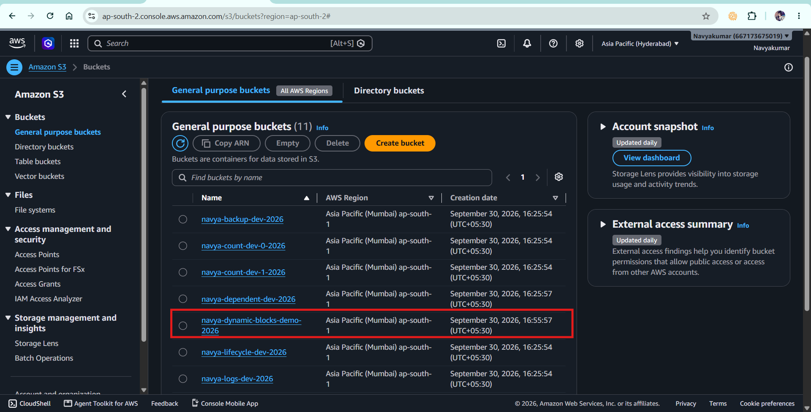
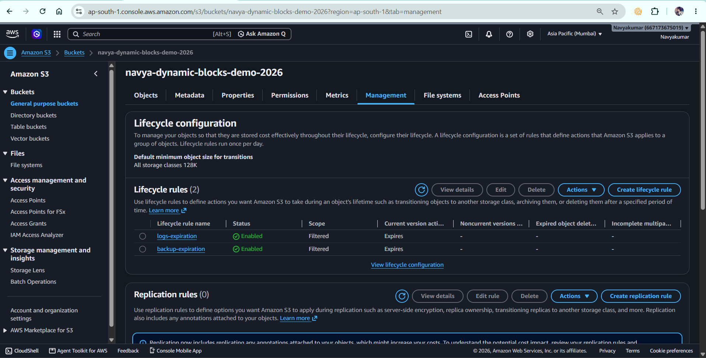
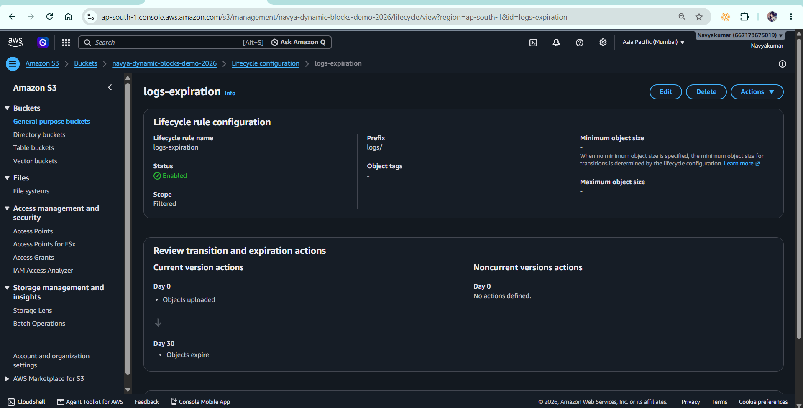

# Terraform Dynamic Blocks – AWS S3 Lifecycle Rules

## 📌 Project Overview

This project demonstrates how to use **Terraform dynamic blocks** to generate repeated nested blocks dynamically.

I used an **AWS S3 bucket** and configured multiple S3 lifecycle rules using a Terraform `dynamic` block.

Instead of manually writing multiple lifecycle `rule` blocks, I defined the rules as input data and used `dynamic` with `for_each` to generate the nested blocks automatically.

### Concepts demonstrated

* Terraform provider configuration
* Input variables
* Complex variable types
* `list(object(...))`
* S3 bucket
* S3 lifecycle configuration
* Dynamic blocks
* `for_each` inside a dynamic block
* Nested blocks
* Terraform outputs
* Terraform state
* Resource references

---

# 🏗️ Project Architecture

```text
                         Terraform
                             |
                             |
                       AWS Provider
                             |
                        ap-south-1
                             |
                         S3 Bucket
                             |
                S3 Lifecycle Configuration
                             |
                    dynamic "rule"
                             |
              +--------------+--------------+
              |                             |
          Rule 1                         Rule 2
              |                             |
        logs-expiration              backup-expiration
        logs/ → 30 days              backup/ → 90 days
```

The important point is:

```text
One S3 bucket
      |
One lifecycle configuration
      |
Multiple dynamically generated rule blocks
```

---

# 📁 Project Structure

```text
05-dynamic-blocks/
│
├── providers.tf
├── variables.tf
├── main.tf
├── outputs.tf
├── terraform.tfvars
├── .gitignore
└── README.md
```

---

# 📄 File-by-File Explanation

## 1. `providers.tf`

### Purpose

This file defines:

* Terraform version
* AWS provider
* AWS provider version
* AWS region

```hcl
terraform {
  required_version = ">= 1.14.0, < 2.0.0"

  required_providers {
    aws = {
      source  = "hashicorp/aws"
      version = "~> 6.0"
    }
  }
}

provider "aws" {
  region = var.aws_region
}
```

### Why use a provider?

Terraform needs a provider to communicate with AWS.

The AWS provider translates Terraform configuration into AWS API operations.

### Interview answer

> "The provider is responsible for allowing Terraform to communicate with AWS. In this project, I configured the HashiCorp AWS provider and specified the target region through an input variable."

---

# 2. `variables.tf`

This file defines the input variables.

## AWS region

```hcl
variable "aws_region" {
  description = "AWS region"
  type        = string
  default     = "ap-south-1"
}
```

This allows the AWS region to be changed without modifying the provider configuration.

---

## Bucket name

```hcl
variable "bucket_name" {
  description = "S3 bucket name"
  type        = string
}
```

The bucket name is supplied through `terraform.tfvars`.

---

# ⭐ Important Variable: `lifecycle_rules`

The most important variable in this project is:

```hcl
variable "lifecycle_rules" {
  description = "List of S3 lifecycle rules"

  type = list(object({
    id     = string
    prefix = string
    days   = number
  }))
}
```

This is a **complex Terraform type**.

It means:

> The variable must contain a list, and every item in the list must be an object containing `id`, `prefix`, and `days`.

---

## Understanding the type

```text
list(object({
    id     = string
    prefix = string
    days   = number
}))
```

Break it down:

```text
list
  ↓
Multiple values

object
  ↓
Each value has multiple named attributes

id
  ↓
string

prefix
  ↓
string

days
  ↓
number
```

So the variable expects something like:

```hcl
[
  {
    id     = "logs-expiration"
    prefix = "logs/"
    days   = 30
  },

  {
    id     = "backup-expiration"
    prefix = "backup/"
    days   = 90
  }
]
```

---

# 3. `terraform.tfvars`

This file provides actual values for the variables.

```hcl
aws_region = "ap-south-1"

bucket_name = "navya-dynamic-blocks-demo-2026"

lifecycle_rules = [
  {
    id     = "logs-expiration"
    prefix = "logs/"
    days   = 30
  },

  {
    id     = "backup-expiration"
    prefix = "backup/"
    days   = 90
  }
]
```

This separates **configuration values** from the Terraform resource definition.

---

# 4. `main.tf`

This is the main infrastructure file.

It contains:

1. S3 bucket
2. S3 lifecycle configuration
3. Dynamic lifecycle rules

---

# 🪣 S3 Bucket

```hcl
resource "aws_s3_bucket" "demo" {

  bucket = var.bucket_name

  tags = {
    Name      = "dynamic-block-demo"
    ManagedBy = "Terraform"
    Project   = "dynamic-blocks"
  }
}
```

This creates the S3 bucket.

The bucket name comes from:

```hcl
var.bucket_name
```

instead of being hardcoded.

---

# 🔄 S3 Lifecycle Configuration

```hcl
resource "aws_s3_bucket_lifecycle_configuration" "demo" {

  bucket = aws_s3_bucket.demo.id

  ...
}
```

This configures lifecycle rules for the bucket.

The reference:

```hcl
aws_s3_bucket.demo.id
```

automatically creates a dependency.

Terraform understands:

```text
S3 Bucket
    ↓
Lifecycle Configuration
```

The lifecycle configuration cannot be applied to a bucket that does not exist.

---

# ⭐ Dynamic Block

The main concept of this project is:

```hcl
dynamic "rule" {

  for_each = var.lifecycle_rules

  content {

    id     = rule.value.id
    status = "Enabled"

    filter {
      prefix = rule.value.prefix
    }

    expiration {
      days = rule.value.days
    }
  }
}
```

---

# 🔍 How the Dynamic Block Works

The variable contains:

```text
Rule 1
logs → 30 days

Rule 2
backup → 90 days
```

Terraform processes:

```hcl
for_each = var.lifecycle_rules
```

and generates a `rule` block for each item.

Conceptually, Terraform generates:

```hcl
rule {
  id     = "logs-expiration"
  status = "Enabled"

  filter {
    prefix = "logs/"
  }

  expiration {
    days = 30
  }
}

rule {
  id     = "backup-expiration"
  status = "Enabled"

  filter {
    prefix = "backup/"
  }

  expiration {
    days = 90
  }
}
```

These blocks don't have to be manually written in the Terraform configuration.

The `dynamic` block generates them.

---

# 🧠 Dynamic Block Components

## `dynamic "rule"`

```hcl
dynamic "rule"
```

This tells Terraform:

> Generate multiple nested blocks named `rule`.

---

## `for_each`

```hcl
for_each = var.lifecycle_rules
```

This tells Terraform:

> Iterate through every item in the lifecycle rules collection.

If there are 2 objects:

```text
2 iterations
```

If there are 3 objects:

```text
3 iterations
```

---

## `content`

```hcl
content {
  ...
}
```

This defines what each generated `rule` block contains.

---

## `rule.value`

Inside the dynamic block:

```hcl
rule.value.id
rule.value.prefix
rule.value.days
```

`rule.value` represents the current object being processed.

For example, during the first iteration:

```text
rule.value.id
    ↓
logs-expiration

rule.value.prefix
    ↓
logs/

rule.value.days
    ↓
30
```

During the second iteration:

```text
rule.value.id
    ↓
backup-expiration

rule.value.prefix
    ↓
backup/

rule.value.days
    ↓
90
```

---

# 🔥 Why Did I Use a Dynamic Block?

Without a dynamic block, I would have to manually write:

```hcl
rule {
  id = "logs-expiration"

  filter {
    prefix = "logs/"
  }

  expiration {
    days = 30
  }
}

rule {
  id = "backup-expiration"

  filter {
    prefix = "backup/"
  }

  expiration {
    days = 90
  }
}
```

This works, but it becomes repetitive when there are many rules.

With a dynamic block:

```hcl
dynamic "rule" {
  for_each = var.lifecycle_rules

  content {
    ...
  }
}
```

I can add another rule simply by changing the input data.

---

# ➕ Adding Another Rule

For example:

```hcl
lifecycle_rules = [
  {
    id     = "logs-expiration"
    prefix = "logs/"
    days   = 30
  },

  {
    id     = "backup-expiration"
    prefix = "backup/"
    days   = 90
  },

  {
    id     = "archive-expiration"
    prefix = "archive/"
    days   = 180
  }
]
```

No change is required in `main.tf`.

The dynamic block automatically generates another nested `rule` block.

This demonstrates why dynamic blocks are useful for **data-driven infrastructure**.

---

# 🧩 `for_each` vs `dynamic`

This is one of the most important interview questions from this project.

## `for_each`

`for_each` can create multiple **resource instances**.

Example:

```hcl
resource "aws_s3_bucket" "demo" {

  for_each = var.bucket_names

  bucket = each.value
}
```

Terraform creates:

```text
aws_s3_bucket.demo["logs"]
aws_s3_bucket.demo["backup"]
```

So:

```text
for_each
   ↓
Multiple RESOURCE INSTANCES
```

---

# Dynamic Block

A dynamic block creates multiple **nested blocks inside a resource**.

Example:

```hcl
resource "aws_s3_bucket_lifecycle_configuration" "demo" {

  dynamic "rule" {

    for_each = var.lifecycle_rules

    content {
      ...
    }
  }
}
```

So:

```text
dynamic
   ↓
Multiple NESTED BLOCKS
   ↓
inside ONE resource
```

---

# ⭐ Easy Way to Remember

```text
for_each
    ↓
Resource
Resource
Resource


dynamic
    ↓
One Resource
    ├── nested block
    ├── nested block
    └── nested block
```

---

# 📊 Comparison

| Feature                        | `for_each`                         | `dynamic`                          |
| ------------------------------ | ---------------------------------- | ---------------------------------- |
| Main purpose                   | Create multiple resource instances | Generate repeated nested blocks    |
| Used on                        | Resource/module instances          | Nested blocks                      |
| Creates                        | Multiple resources                 | Multiple nested blocks             |
| Uses collection                | Yes                                | Yes                                |
| Uses `each.key` / `each.value` | Yes                                | Dynamic block has its own iterator |
| Example                        | Multiple S3 buckets                | Multiple S3 lifecycle rules        |

---

# 📄 `outputs.tf`

The project contains:

```hcl
output "bucket_name" {
  description = "S3 bucket name"

  value = aws_s3_bucket.demo.bucket
}
```

This displays the created bucket name.

The project also contains:

```hcl
output "lifecycle_rule_count" {
  description = "Number of lifecycle rules configured"

  value = length(var.lifecycle_rules)
}
```

This tells us how many lifecycle rules were supplied.

For example:

```text
lifecycle_rule_count = 2
```

---

# 🔄 Terraform Workflow

The project follows the standard Terraform workflow:

```text
Terraform Configuration
        ↓
terraform init
        ↓
terraform fmt
        ↓
terraform validate
        ↓
terraform plan
        ↓
terraform apply
        ↓
AWS Infrastructure
        ↓
terraform output
        ↓
terraform destroy
```

---

# 🛠️ Commands Used

## Initialize

```bash
terraform init
```

Downloads and initializes the required provider.

---

## Format

```bash
terraform fmt
```

Formats Terraform configuration according to Terraform's standard formatting.

---

## Validate

```bash
terraform validate
```

Checks whether the Terraform configuration is syntactically valid and internally consistent.

---

## Plan

```bash
terraform plan
```

Shows what Terraform intends to create, modify, or destroy.

---

## Apply

```bash
terraform apply
```

Creates or modifies the AWS infrastructure.

---

## Output

```bash
terraform output
```

Displays Terraform output values.

---

## Destroy

```bash
terraform destroy
```

Removes the infrastructure managed by this project.

---

# 🧪 Hands-On Test Performed

Initially, the project contains:

```text
logs → 30 days
backup → 90 days
```

I then added:

```text
archive → 180 days
```

to the `lifecycle_rules` variable.

The Terraform configuration itself did not need another manually written `rule` block.

The dynamic block automatically generated the additional nested lifecycle rule.

This demonstrates the main purpose of dynamic blocks.

---

# 🎤 Interview Questions & Answers

## Q1. What is a dynamic block in Terraform?

### Answer

> "A dynamic block allows Terraform to generate repeated nested blocks dynamically from a collection. It is useful when a resource contains a nested block that needs to be repeated based on variable input."

---

## Q2. Why did you use a dynamic block in this project?

### Answer

> "I used a dynamic block to generate multiple S3 lifecycle `rule` blocks from a list of lifecycle rule objects. This avoids manually writing every rule and makes the configuration data-driven."

---

## Q3. What is the difference between `for_each` and `dynamic`?

### Answer

> "`for_each` is used to create multiple resource or module instances, whereas a dynamic block is used to generate repeated nested blocks within a resource. In my project, `dynamic` generates multiple S3 lifecycle `rule` blocks."

---

## Q4. Does a dynamic block create multiple resources?

### Answer

> "No. A dynamic block does not create separate Terraform resources. It generates repeated nested blocks inside an existing resource."

---

## Q5. What does `content` mean in a dynamic block?

### Answer

> "`content` defines the contents of each dynamically generated nested block. Terraform evaluates the content once for every item in the dynamic block's collection."

---

## Q6. What is `rule.value`?

### Answer

> "`rule.value` represents the current item being processed by the dynamic block. In my project, each value is an object containing the lifecycle rule ID, prefix, and expiration days."

---

## Q7. Why did you use `list(object(...))`?

### Answer

> "I used `list(object(...))` because every lifecycle rule has multiple related attributes: an ID, a prefix, and the number of expiration days. The object type allows me to group those attributes together, while the list allows me to define multiple rules."

---

## Q8. What is a complex variable type?

### Answer

> "A complex type contains multiple values or structured values rather than a single primitive value. Examples include lists, sets, maps, tuples, and objects. In this project I used a list of objects."

---

## Q9. What is the difference between a list and an object?

### Answer

> "A list is an ordered collection of values, while an object is a collection of named attributes with defined types."

Example:

```hcl
list(string)
```

contains multiple strings.

While:

```hcl
object({
  id   = string
  days = number
})
```

contains named attributes.

---

## Q10. Why not simply write the lifecycle rules manually?

### Answer

> "Manual blocks are acceptable for a small fixed configuration, but they become repetitive when the number of rules increases. A dynamic block allows me to keep the Terraform resource definition generic and drive the number and values of rules through variables."

---

## Q11. Can dynamic blocks be nested?

### Answer

> "Yes. Dynamic blocks can be used for nested structures when the provider schema supports the required nested blocks. However, I would use them only where they improve maintainability because excessive dynamic blocks can make Terraform configurations harder to understand."

---

## Q12. Can I use `dynamic` for meta-arguments such as `lifecycle` or `depends_on`?

### Answer

> "No. Dynamic blocks are intended for generating nested blocks supported by the resource schema. Terraform meta-arguments such as `lifecycle` and `depends_on` are handled specially by Terraform and cannot generally be generated using dynamic blocks."

This is an important interview point.

---

## Q13. Can every Terraform nested block be generated dynamically?

### Answer

> "A dynamic block can generate nested blocks that are supported by the resource schema. It cannot be used to arbitrarily create Terraform syntax or attributes that the provider resource does not support."

---

## Q14. What is the iterator in a dynamic block?

### Answer

By default, the iterator name is the dynamic block label.

For:

```hcl
dynamic "rule" {
  for_each = var.lifecycle_rules

  content {
    id = rule.value.id
  }
}
```

the iterator is:

```text
rule
```

and:

```text
rule.value
```

represents the current item.

---

## Q15. Can you specify a custom iterator?

### Answer

Yes.

For example:

```hcl
dynamic "rule" {
  for_each = var.lifecycle_rules

  iterator = lifecycle_rule

  content {
    id = lifecycle_rule.value.id
  }
}
```

This can make complex configurations easier to understand.

---

# 🎯 Scenario-Based Interview Questions

## Q16. You have 20 security group ingress rules. Would you manually create 20 blocks?

### Answer

> "If the rules are data-driven and follow the same structure, I could represent them as a collection of objects and use a dynamic block to generate the repeated nested ingress blocks. This reduces duplication and makes the configuration easier to modify."

---

## Q17. You need 5 S3 buckets. Would you use a dynamic block?

### Answer

> "No. If I need five separate S3 resources, I would use `count` or `for_each`. Dynamic blocks are for repeated nested blocks within a resource, not for creating separate resources."

---

## Q18. You need multiple lifecycle rules inside one S3 bucket. What would you use?

### Answer

> "I can use a dynamic block because the lifecycle rules are nested blocks inside the S3 lifecycle configuration resource."

---

## Q19. If you add another lifecycle rule, do you need to modify `main.tf`?

### Answer

> "No. In my implementation, I only need to add another object to the `lifecycle_rules` variable. The dynamic block automatically generates the corresponding nested rule."

---

## Q20. What problem does this solve?

### Answer

> "It reduces repetitive Terraform configuration and separates infrastructure structure from the actual rule data. The Terraform resource remains generic while the number and values of lifecycle rules are driven through variables."

---

# 🔥 Interviewer: Explain Your Project

If the interviewer says:

> **"Explain your dynamic blocks project."**

You can answer:

> "I created a Terraform project using AWS S3 to understand dynamic blocks. The project creates an S3 bucket and configures its lifecycle rules.
>
> I defined the lifecycle rules as a `list(object(...))` variable, where each object contains an ID, prefix, and expiration period. Instead of manually defining multiple lifecycle rule blocks, I used a Terraform `dynamic` block with `for_each` to generate the nested `rule` blocks automatically.
>
> For example, my input contains separate rules for logs and backups. Terraform iterates over the collection, and `rule.value` provides the attributes for each iteration.
>
> The main concept I learned is the difference between `for_each` and `dynamic`: `for_each` creates multiple resource instances, while a dynamic block generates repeated nested blocks inside a resource.
>
> I also used Terraform variables and outputs and followed the standard Terraform workflow of init, format, validate, plan, apply, and destroy."

---

# ⭐ Interviewer Follow-Up: Why is this useful in real projects?

You can say:

> "Dynamic blocks are useful when infrastructure contains repeated nested configuration that varies based on input data. Common examples include security group rules, IAM policy statements in certain resource schemas, load balancer rules, route configurations, and other provider resources with repeatable nested blocks."

---

# ⚠️ Important Best Practice

Dynamic blocks should not be used everywhere.

If there are only one or two simple nested blocks, writing them explicitly may be easier to read.

Use dynamic blocks when:

```text
Many repeated nested blocks
        +
Data-driven configuration
        +
Same block structure
```

makes the configuration more maintainable.

---

# 🔐 `.gitignore`

The project ignores Terraform-generated and sensitive/local files:

```gitignore
.terraform/

*.tfstate
*.tfstate.*

crash.log
crash.*.log

*.tfplan

terraform.exe

terraform.tfvars
terraform.tfvars.json
```

The following should normally be committed:

```text
.terraform.lock.hcl
providers.tf
variables.tf
main.tf
outputs.tf
.gitignore
README.md
```

---

# 🧹 Cleanup

After completing the lab:

```bash
terraform destroy
```

Confirm the destruction when prompted.

This removes the AWS resources created by the project.

---

# 📚 Skills Demonstrated

```text
Terraform
│
├── Provider Configuration
│
├── Variables
│   ├── string
│   ├── list
│   ├── object
│   └── list(object(...))
│
├── AWS S3
│
├── S3 Lifecycle Configuration
│
├── Dynamic Blocks
│   ├── dynamic
│   ├── for_each
│   ├── content
│   └── iterator concept
│
├── Nested Blocks
│
├── Resource References
│
├── Outputs
│
└── Terraform Workflow
    ├── init
    ├── fmt
    ├── validate
    ├── plan
    ├── apply
    └── destroy
```

---




     