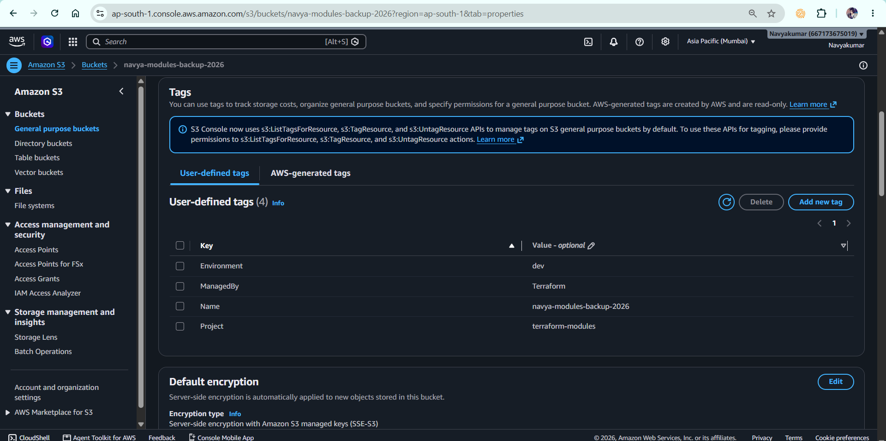
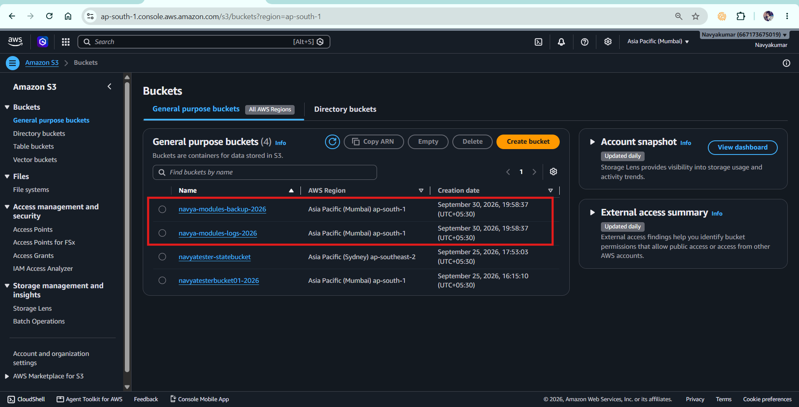
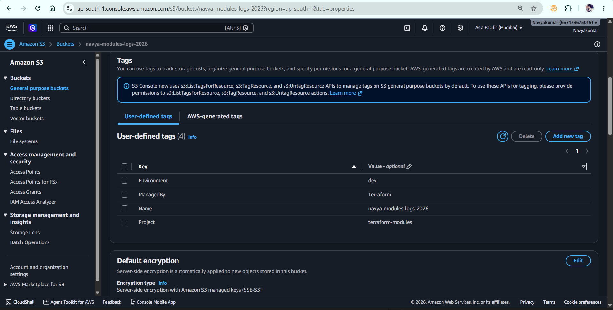

# Project 06 – Terraform Modules

## 📌 Project Overview

This project demonstrates how to use **Terraform Modules** to create reusable and maintainable infrastructure code.

Instead of writing the same S3 bucket resource multiple times, I created a reusable **child module** for an S3 bucket and called that module from the **root module**.

The project also demonstrates how a module can be used multiple times with `for_each`.

### Technologies Used

* Terraform
* AWS
* AWS S3
* Terraform Modules
* Terraform Variables
* Terraform Outputs
* Terraform `for_each`

---

# 🎯 What I Learned

In this project, I learned:

* What Terraform modules are
* Difference between Root Module and Child Module
* How to create a local reusable module
* How to pass variables from a root module to a child module
* How to return values from a child module using outputs
* How to call a local module using `source`
* How to use `for_each` with modules
* How Terraform creates multiple module instances
* How module outputs are accessed from the root module
* How modules improve code reusability and maintainability
* How Terraform state represents module resources
* How to troubleshoot module directory errors

---

# 📁 Project Structure

```text
06-modules/
│
├── providers.tf
├── variables.tf
├── main.tf
├── outputs.tf
├── terraform.tfvars
├── .gitignore
│
└── modules/
    └── s3-bucket/
        ├── main.tf
        ├── variables.tf
        └── outputs.tf
```

---

# 🏗️ Architecture

```text
                    Root Module
                    06-modules
                         |
                         |
                  module "s3_bucket"
                         |
                  source = "./modules/s3-bucket"
                         |
              -------------------------
              |                       |
              ↓                       ↓
       Child Module Instance 1  Child Module Instance 2
              |                       |
              ↓                       ↓
          S3 Bucket               S3 Bucket
       Logs Bucket             Backup Bucket
```

The root module calls the reusable S3 child module.

The module is called multiple times using `for_each`.

---

# 1️⃣ Root Module

The root module contains the main Terraform configuration that Terraform executes.

## providers.tf

```hcl
terraform {
  required_version = ">= 1.14.0, < 2.0.0"

  required_providers {
    aws = {
      source  = "hashicorp/aws"
      version = "~> 6.0"
    }
  }
}

provider "aws" {
  region = var.aws_region
}
```

### Purpose

This file:

* Defines the Terraform version constraint
* Defines the AWS provider
* Specifies the AWS provider version
* Configures the AWS region

---

# 2️⃣ Root Variables

## variables.tf

```hcl
variable "aws_region" {
  description = "AWS region where the S3 buckets will be created"
  type        = string
  default     = "ap-south-1"
}

variable "environment" {
  description = "Environment name"
  type        = string
  default     = "dev"
}

variable "bucket_names" {
  description = "Names of S3 buckets to create using the reusable module"
  type        = set(string)
}
```

The `bucket_names` variable allows us to provide multiple bucket names.

---

# 3️⃣ Calling the Child Module

## main.tf

```hcl
module "s3_bucket" {
  source = "./modules/s3-bucket"

  for_each = var.bucket_names

  bucket_name = each.value
  environment = var.environment
}
```

This is the most important part of the project.

### `module "s3_bucket"`

This defines a module block.

### `source`

```hcl
source = "./modules/s3-bucket"
```

This tells Terraform where the child module is located.

It is a **local module** because the module exists inside the project.

### `for_each`

```hcl
for_each = var.bucket_names
```

This creates one module instance for every bucket name.

For example:

```hcl
bucket_names = [
  "navya-modules-logs-2026",
  "navya-modules-backup-2026"
]
```

Terraform creates two module instances.

Conceptually:

```text
module.s3_bucket["navya-modules-logs-2026"]

module.s3_bucket["navya-modules-backup-2026"]
```

---

# 4️⃣ Child Module

The child module is located at:

```text
modules/s3-bucket/
```

This module contains the reusable S3 bucket configuration.

---

## Child Module main.tf

```hcl
resource "aws_s3_bucket" "this" {
  bucket = var.bucket_name

  tags = {
    Name        = var.bucket_name
    Environment = var.environment
    ManagedBy   = "Terraform"
    Project     = "terraform-modules"
  }
}
```

The module doesn't hardcode the bucket name.

Instead, it receives the bucket name from the root module through:

```hcl
var.bucket_name
```

---

# 5️⃣ Child Module Variables

## modules/s3-bucket/variables.tf

```hcl
variable "bucket_name" {
  description = "Name of the S3 bucket"
  type        = string
}

variable "environment" {
  description = "Environment associated with the bucket"
  type        = string
}
```

These variables act as **inputs to the child module**.

The root module provides the values:

```hcl
bucket_name = each.value
environment = var.environment
```

---

# 6️⃣ Child Module Outputs

## modules/s3-bucket/outputs.tf

```hcl
output "bucket_name" {
  description = "Name of the S3 bucket"

  value = aws_s3_bucket.this.bucket
}

output "bucket_arn" {
  description = "ARN of the S3 bucket"

  value = aws_s3_bucket.this.arn
}
```

The child module exposes these values to the root module.

---

# 7️⃣ Root Module Outputs

## outputs.tf

```hcl
output "bucket_names" {
  description = "Names of S3 buckets created by the module"

  value = {
    for name, bucket in module.s3_bucket :
    name => bucket.bucket_name
  }
}

output "bucket_arns" {
  description = "ARNs of S3 buckets created by the module"

  value = {
    for name, bucket in module.s3_bucket :
    name => bucket.bucket_arn
  }
}
```

The root module collects the outputs from all module instances.

---

# 8️⃣ Terraform Variables

## terraform.tfvars

```hcl
aws_region = "ap-south-1"

environment = "dev"

bucket_names = [
  "navya-modules-logs-2026",
  "navya-modules-backup-2026"
]
```

This provides the actual values for the input variables.

---

# 🔄 How Data Flows Through the Module

This is an important concept for interviews.

```text
terraform.tfvars
       |
       ↓
root variable
bucket_names
       |
       ↓
for_each
       |
       ↓
module block
       |
       ↓
child module variables
       |
       ↓
S3 resource
       |
       ↓
child module outputs
       |
       ↓
root module outputs
```

Example:

```text
"navya-modules-logs-2026"
              ↓
        each.value
              ↓
        bucket_name
              ↓
      var.bucket_name
              ↓
      aws_s3_bucket.this
              ↓
       bucket_name output
```

---

# 🛠️ Terraform Commands Used

I executed Terraform from the root module:

```powershell
cd "C:\Users\navya\OneDrive\Desktop\Terraform final\06-modules"
```

### Format

```powershell
terraform fmt -recursive
```

Formats Terraform files in the root directory and subdirectories.

The `-recursive` option is useful here because the project contains:

```text
06-modules/
└── modules/
    └── s3-bucket/
```

---

### Initialize

```powershell
terraform init
```

This initializes the Terraform working directory and downloads the required provider and initializes the local module.

---

### Validate

```powershell
terraform validate
```

Checks whether the Terraform configuration is syntactically valid and internally consistent.

---

### Plan

```powershell
terraform plan
```

Shows what Terraform intends to create, modify, or destroy without making changes.

Expected result:

```text
Plan: 2 to add, 0 to change, 0 to destroy.
```

---

### Apply

```powershell
terraform apply
```

Creates the infrastructure in AWS.

---

### View Outputs

```powershell
terraform output
```

Displays the outputs defined by the root module.

---

### View State

```powershell
terraform state list
```

Example module resource addresses:

```text
module.s3_bucket["navya-modules-backup-2026"].aws_s3_bucket.this
module.s3_bucket["navya-modules-logs-2026"].aws_s3_bucket.this
```

This demonstrates that Terraform tracks resources created through module instances.

---

### Destroy

```powershell
terraform destroy
```

Removes the infrastructure created by Terraform.

---

# 🐛 Issue Faced During the Project

## Issue 1 – Module Directory Error

Initially, the module directory was not structured correctly.

Terraform expected:

```text
modules/s3-bucket
```

but the `s3-bucket` directory was placed directly under the project.

Terraform showed:

```text
Error: Unreadable module directory
```

### Root Cause

The `source` in `main.tf` was:

```hcl
source = "./modules/s3-bucket"
```

but that directory did not exist at the expected location.

### Fix

Created the correct structure:

```text
06-modules/
└── modules/
    └── s3-bucket/
```

This helped me understand that the module `source` path must point to the actual module directory.

---

# 🐛 Issue 2 – Duplicate Resource

I also encountered a duplicate resource error because the S3 resource was accidentally present in both:

```text
modules/s3-bucket/main.tf
```

and

```text
modules/s3-bucket/outputs.tf
```

Terraform reported:

```text
Duplicate resource "aws_s3_bucket" configuration
```

### Root Cause

The same resource was declared twice with the same resource type and name:

```hcl
aws_s3_bucket.this
```

### Fix

I separated the files correctly:

```text
main.tf
    → Resource

variables.tf
    → Variables

outputs.tf
    → Outputs
```

This reinforced the importance of keeping Terraform module files logically organized.

---

# 🔐 .gitignore

The following generated/local files should not be committed:

```gitignore
.terraform/

*.tfstate
*.tfstate.*

crash.log
crash.*.log

*.tfplan

terraform.exe

terraform.tfvars
terraform.tfvars.json
```

### Important

I should **not ignore**:

```text
.terraform.lock.hcl
```

The dependency lock file should generally be committed so that provider selections/checksums are consistent across environments.

---

# 💡 Why Do We Use Terraform Modules?

Without modules, we may repeatedly write:

```hcl
resource "aws_s3_bucket" "logs" {
  ...
}

resource "aws_s3_bucket" "backup" {
  ...
}

resource "aws_s3_bucket" "archive" {
  ...
}
```

This creates duplicated code.

With a module:

```text
Root Module
     |
     ↓
Reusable S3 Module
     |
     ├── Logs bucket
     ├── Backup bucket
     └── Archive bucket
```

The implementation is written once and reused.

---

# 🎯 What an Interviewer Expects Me to Understand

An interviewer generally wants to know more than:

> "I know Terraform modules."

I should be able to explain:

1. What a module is
2. Why modules are used
3. Root vs child modules
4. Local vs remote modules
5. How variables are passed to modules
6. How outputs are returned from modules
7. How module `for_each` works
8. Module addressing in Terraform state
9. How modules improve reusability
10. How modules help standardize infrastructure
11. How to version reusable modules
12. How to structure modules in a real project

---

# 🎤 Interview Questions and Answers

## Q1. What is a Terraform module?

**Answer:**

A Terraform module is a reusable collection of Terraform configuration files that can be used to create and manage infrastructure.

For example, I created an S3 bucket module containing the S3 resource, variables, and outputs. I can call this module multiple times instead of rewriting the S3 configuration.

---

## Q2. What is the difference between a root module and a child module?

**Answer:**

The **root module** is the directory from which I run Terraform commands.

A **child module** is a reusable module called by the root module using a `module` block.

In my project:

```text
06-modules/
```

is the root module.

```text
modules/s3-bucket/
```

is the child module.

---

## Q3. Why did you create a separate S3 module?

**Answer:**

I created the S3 module to avoid duplicating S3 bucket configuration.

If my organization needs multiple buckets with similar configuration, I can reuse the same module and pass different values such as bucket name and environment.

---

## Q4. How do you call a local module?

**Answer:**

I use the `source` argument:

```hcl
module "s3_bucket" {
  source = "./modules/s3-bucket"
}
```

The path tells Terraform where the child module is located.

---

## Q5. How do you pass variables to a module?

**Answer:**

The root module passes values to the child module through arguments.

For example:

```hcl
module "s3_bucket" {
  source = "./modules/s3-bucket"

  bucket_name = each.value
  environment = var.environment
}
```

The child module defines corresponding variables:

```hcl
variable "bucket_name" {
  type = string
}
```

---

## Q6. How do you get values back from a module?

**Answer:**

I use outputs in the child module.

For example:

```hcl
output "bucket_arn" {
  value = aws_s3_bucket.this.arn
}
```

The root module can then access the module output.

---

## Q7. Can you use `for_each` with a module?

**Answer:**

Yes.

In my project I used:

```hcl
module "s3_bucket" {
  source = "./modules/s3-bucket"

  for_each = var.bucket_names

  bucket_name = each.value
  environment = var.environment
}
```

This creates one module instance for every value in `bucket_names`.

---

## Q8. What is the difference between `for_each` on a resource and `for_each` on a module?

**Answer:**

With resource `for_each`, Terraform creates multiple instances of a specific resource.

With module `for_each`, Terraform creates multiple instances of the entire module.

For example:

```hcl
resource "aws_s3_bucket" "example" {
  for_each = var.buckets
}
```

creates multiple S3 resource instances.

Whereas:

```hcl
module "s3_bucket" {
  for_each = var.buckets
}
```

creates multiple module instances, and each module can contain multiple resources.

---

## Q9. What does this address mean?

```text
module.s3_bucket["navya-modules-logs-2026"].aws_s3_bucket.this
```

**Answer:**

It represents an S3 resource created inside a specific module instance.

Breaking it down:

```text
module.s3_bucket
        ↓
module name

["navya-modules-logs-2026"]
        ↓
for_each instance

aws_s3_bucket.this
        ↓
resource inside the module
```

---

## Q10. What happens if you add another bucket name?

Suppose I add:

```hcl
"navya-modules-archive-2026"
```

to:

```hcl
bucket_names = [
  "navya-modules-logs-2026",
  "navya-modules-backup-2026",
  "navya-modules-archive-2026"
]
```

Terraform detects the new module instance.

The plan should show one additional resource to create, assuming the other two already exist.

---

## Q11. What are the advantages of Terraform modules?

**Answer:**

The main advantages are:

* Code reusability
* Reduced duplication
* Standardization
* Easier maintenance
* Consistent infrastructure
* Better organization
* Easier scaling
* Easier collaboration between teams

---

## Q12. What is a local module?

**Answer:**

A local module is a module stored on the local filesystem.

For example:

```hcl
source = "./modules/s3-bucket"
```

The module exists inside my Terraform project.

---

## Q13. Can Terraform modules come from remote sources?

**Answer:**

Yes.

Modules can be sourced from locations such as:

* Terraform Registry
* Git repositories
* GitHub
* Object storage
* Other supported remote module sources

For example, an organization could maintain a centralized networking module and reuse it across multiple projects.

---

## Q14. What is a module registry?

**Answer:**

A module registry is a repository or service where reusable Terraform modules can be published and consumed.

Terraform Registry is a common example.

Organizations can also maintain private module registries.

---

## Q15. How would you version a module?

**Answer:**

For production, I would version reusable modules, especially when they are shared across multiple teams.

For example:

```text
s3-module v1.0.0
s3-module v1.1.0
s3-module v2.0.0
```

Consumers can then intentionally select a compatible version instead of automatically receiving breaking changes.

---

## Q16. Are modules only used to reduce code?

**Answer:**

No.

Code reuse is one benefit, but modules are also used for **standardization and abstraction**.

For example, a company could create a standard S3 module that automatically applies:

* Required tags
* Encryption
* Versioning
* Logging
* Security configurations
* Naming conventions

Different teams can reuse that standard module.

---

## Q17. What happens during `terraform init` with modules?

**Answer:**

During initialization, Terraform initializes the working directory and downloads or prepares the required providers and modules.

For a local module such as:

```hcl
source = "./modules/s3-bucket"
```

Terraform recognizes and initializes the local module.

---

## Q18. What is the difference between a module and a resource?

**Answer:**

A resource represents an actual infrastructure object managed by Terraform.

Example:

```hcl
resource "aws_s3_bucket" "this" {
}
```

A module is a reusable collection of Terraform configuration that can contain one or more resources.

So:

```text
Resource → infrastructure object

Module → reusable infrastructure configuration
```

---

## Q19. Can a module contain multiple resources?

**Answer:**

Yes.

For example, an AWS application module could contain:

```text
VPC
├── Subnets
├── Route Tables
├── Security Groups
├── EC2
└── IAM
```

This allows the complete infrastructure pattern to be reused.

---

## Q20. Why are modules important in DevOps/DevSecOps?

**Answer:**

Modules help teams standardize infrastructure and enforce consistent configurations.

For example, a DevSecOps team could create reusable modules with security controls such as encryption, logging, IAM restrictions, and required tags.

This reduces the chance of teams implementing infrastructure differently.

---

# ⭐ Scenario-Based Interview Questions

## Q21. You have 20 applications that need the same S3 configuration. Would you write 20 resources?

**Answer:**

No. I would create a reusable S3 module and pass application-specific values as variables.

This allows me to maintain the common configuration in one place.

---

## Q22. One team wants a different bucket name but the same S3 configuration. What would you do?

**Answer:**

I would keep the common configuration inside the module and pass the bucket name as an input variable.

For example:

```hcl
module "s3_bucket" {
  source = "./modules/s3-bucket"

  bucket_name = "application-logs"
  environment = "prod"
}
```

---

## Q23. Your module works for development but production needs additional security. What would you do?

**Answer:**

I would avoid duplicating the entire module.

Instead, I could make the required security settings configurable through variables, or create a versioned production-specific module depending on the organization's architecture.

The goal would be to maintain reuse while allowing controlled configuration differences.

---

## Q24. What would you put inside a reusable production S3 module?

**Answer:**

Depending on the organization's requirements, I could include:

* S3 bucket
* Encryption
* Versioning
* Lifecycle configuration
* Access controls
* Logging
* Required tags
* Security-related configuration
* Variables
* Outputs

The exact configuration would depend on organizational requirements.

---

# 🧠 30-Second Interview Explanation

If the interviewer asks:

> **"Explain the Terraform modules project you worked on."**

I can answer:

> "I created a reusable Terraform S3 module. I separated the project into a root module and a child module. The child module contains the reusable S3 bucket configuration, variables, and outputs. From the root module, I call the child module using a local source path and use `for_each` to create multiple module instances for different S3 buckets. I also used input variables to pass bucket names and environment information into the module and outputs to return bucket names and ARNs. During the project, I also learned how modules are represented in Terraform state and troubleshot issues such as incorrect module directory paths and duplicate resource declarations."

---

# 🔥 Key Interview Points to Remember

Remember these five points:

```text
MODULE
   ↓
Reusable Terraform Configuration

ROOT MODULE
   ↓
Where Terraform execution starts

CHILD MODULE
   ↓
Reusable module called by root

VARIABLES
   ↓
Input into module

OUTPUTS
   ↓
Values returned from module
```

And remember:

```text
Resource for_each
        ↓
Multiple resource instances

Module for_each
        ↓
Multiple module instances




# 🏆 Project Outcome

Through this project, I implemented a reusable Terraform module for AWS S3 and used `for_each` to create multiple module instances.

The project helped me understand how Terraform modules can be used to build **reusable, standardized, and maintainable Infrastructure as Code**.

This concept is important for larger DevOps and DevSecOps environments where infrastructure is maintained across multiple applications and environments.
