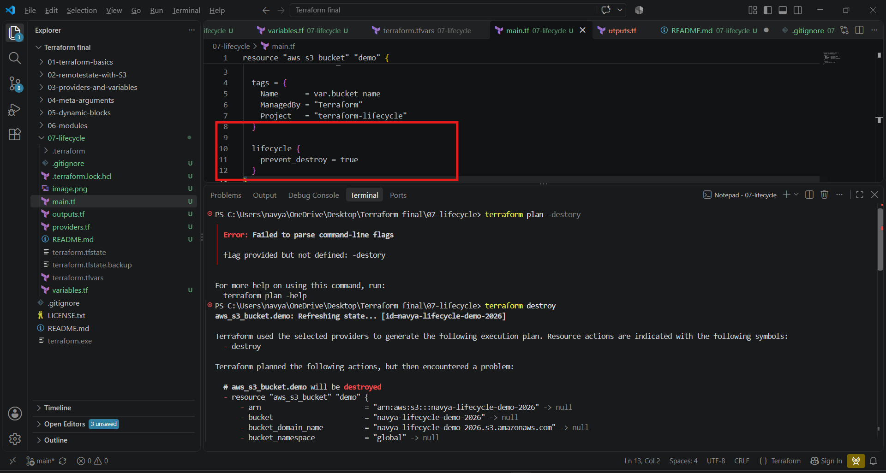
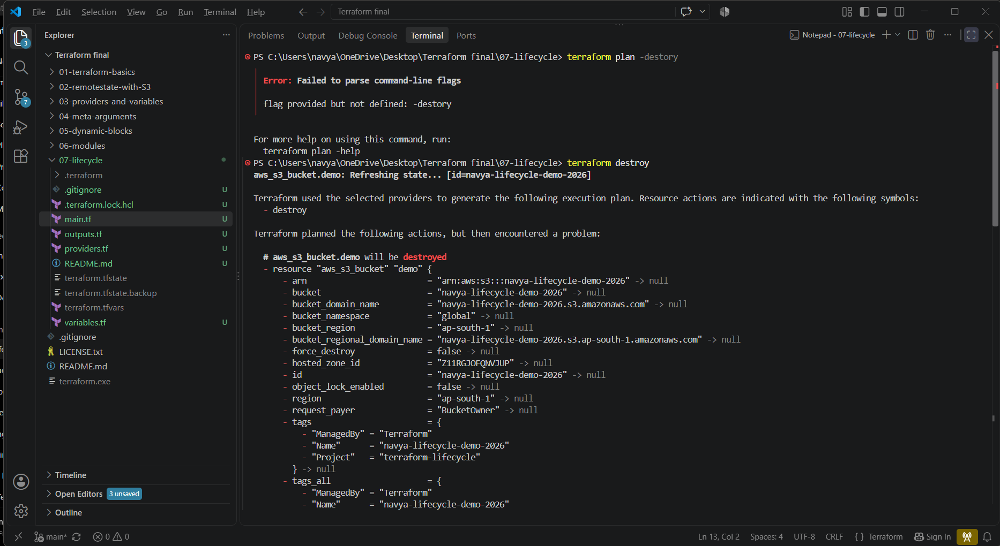

# Project 07 – Terraform Lifecycle

## 📌 Project Overview

This project demonstrates how to use **Terraform Lifecycle Meta-Arguments** to control how Terraform manages the creation, replacement, update, and destruction of resources.

I used an **AWS S3 bucket** as the infrastructure resource and studied the following lifecycle arguments:

* `create_before_destroy`
* `prevent_destroy`
* `ignore_changes`

The objective of this project is not only to create an AWS resource, but to understand **how Terraform behaves when infrastructure changes occur**.

---

# 🎯 Interview Objective

In an interview, I should be able to explain:

> "Terraform lifecycle meta-arguments allow me to control Terraform's behavior when creating, updating, replacing, or destroying resources."

I should be able to explain each lifecycle argument with:

1. Definition
2. Syntax
3. Why it is used
4. Real-world use case
5. Expected Terraform behavior
6. Limitations or considerations

---

# 🛠️ Technologies Used

* Terraform
* AWS
* Amazon S3
* Terraform Lifecycle Meta-Arguments
* Terraform Variables
* Terraform Outputs
* PowerShell

---

# 📁 Project Structure

```text
07-lifecycle/
│
├── providers.tf
├── variables.tf
├── main.tf
├── outputs.tf
├── terraform.tfvars
├── .gitignore
└── README.md
```

---

# 🏗️ Project Flow

```text
                 Terraform Configuration
                          |
                          ↓
                       main.tf
                          |
                          ↓
                  AWS S3 Bucket Resource
                          |
                    lifecycle block
                          |
          ┌───────────────┼────────────────┐
          ↓               ↓                ↓
 create_before_destroy  prevent_destroy  ignore_changes
          |               |                |
          ↓               ↓                ↓
 Replacement order     Protect delete    Ignore selected
                                      attribute changes
```

---

# 1️⃣ Terraform Provider Configuration

## providers.tf

```hcl
terraform {
  required_version = ">= 1.14.0, < 2.0.0"

  required_providers {
    aws = {
      source  = "hashicorp/aws"
      version = "~> 6.0"
    }
  }
}

provider "aws" {
  region = var.aws_region
}
```

### Purpose

This configuration:

* Defines the Terraform version constraint
* Defines the AWS provider
* Specifies the AWS provider version
* Configures the AWS region

---

# 2️⃣ Input Variables

## variables.tf

```hcl
variable "aws_region" {
  description = "AWS region where the S3 bucket will be created"
  type        = string
  default     = "ap-south-1"
}

variable "bucket_name" {
  description = "Name of the lifecycle demo S3 bucket"
  type        = string
}
```

---

# 3️⃣ Variable Values

## terraform.tfvars

```hcl
aws_region = "ap-south-1"

bucket_name = "navya-lifecycle-demo-2026"
```

If the bucket name is already taken, a globally unique name should be used.

---

# 4️⃣ S3 Resource

## main.tf

The S3 bucket is the resource used to demonstrate lifecycle behavior.

Example:

```hcl
resource "aws_s3_bucket" "demo" {
  bucket = var.bucket_name

  tags = {
    Name      = var.bucket_name
    ManagedBy = "Terraform"
    Project   = "terraform-lifecycle"
  }

  lifecycle {
    create_before_destroy = true
  }
}
```

The important part is:

```hcl
lifecycle {
  create_before_destroy = true
}
```

The lifecycle block changes Terraform's normal resource-management behavior.

---

# 🧠 What is Terraform Lifecycle?

Terraform lifecycle is a set of **resource-level meta-arguments** that allow us to customize how Terraform manages resource changes.

The commonly used lifecycle arguments are:

```text
create_before_destroy
prevent_destroy
ignore_changes
```

Easy way to remember:

```text
CREATE / REPLACE
        ↓
create_before_destroy

DESTROY
        ↓
prevent_destroy

CHANGE
        ↓
ignore_changes
```

---

# 5️⃣ Lifecycle Argument 1 – create_before_destroy

## Configuration

```hcl
lifecycle {
  create_before_destroy = true
}
```

### What does it mean?

When Terraform needs to replace a resource, this setting tells Terraform to attempt to:

```text
Create new resource
        ↓
Destroy old resource
```

instead of:

```text
Destroy old resource
        ↓
Create new resource
```

### Why is this useful?

It can help reduce downtime when a resource must be replaced.

### Real-world example

Suppose an application server must be replaced.

Without this behavior:

```text
Old server
    ↓
Destroyed
    ↓
New server created
```

There could be a period where the application is unavailable.

With:

```hcl
create_before_destroy = true
```

Terraform attempts:

```text
New server created
        ↓
New server becomes available
        ↓
Old server destroyed
```

### Interview Definition

> "`create_before_destroy` tells Terraform to create a replacement resource before destroying the existing resource when replacement is required."

### Important S3 consideration

S3 bucket names are globally unique. Therefore, you cannot normally create another S3 bucket with the **same name** while the original bucket exists.

So this project uses S3 primarily to understand the lifecycle configuration. A resource whose replacement can coexist with the old instance is more suitable for demonstrating the actual replacement order.

---

# 6️⃣ Lifecycle Argument 2 – prevent_destroy

## Configuration

```hcl
lifecycle {
  prevent_destroy = true
}
```

### What does it mean?

It prevents Terraform from destroying the resource through Terraform configuration.

Example:

```hcl
resource "aws_s3_bucket" "demo" {
  bucket = var.bucket_name

  lifecycle {
    prevent_destroy = true
  }
}
```

If Terraform is asked to destroy this resource, Terraform should produce an error instead of proceeding with the destruction.

### Why is this useful?

It can protect important infrastructure from accidental deletion.

### Real-world examples

Possible examples include:

```text
Production database
Production storage
Critical infrastructure
Important state storage
```

### Interview Definition

> "`prevent_destroy` is used to prevent accidental destruction of a resource managed by Terraform."

### Important consideration

It does not mean the resource can never be deleted by any means. It specifically affects Terraform's planned destruction of the protected resource.

Also, it should not be added blindly to every resource because intentional changes or destruction may become more difficult.

---

# 7️⃣ Lifecycle Argument 3 – ignore_changes

## Configuration

```hcl
lifecycle {
  ignore_changes = [
    tags
  ]
}
```

### What does it mean?

It tells Terraform to ignore changes to the specified resource attribute when Terraform evaluates changes.

Example:

```hcl
resource "aws_s3_bucket" "demo" {
  bucket = var.bucket_name

  tags = {
    Name      = var.bucket_name
    ManagedBy = "Terraform"
    Project   = "terraform-lifecycle"
  }

  lifecycle {
    ignore_changes = [
      tags
    ]
  }
}
```

### Why is this useful?

Sometimes another system or team intentionally manages a particular attribute.

Without `ignore_changes`, Terraform may repeatedly detect that difference and attempt to change it back to the configuration.

### Real-world example

Suppose Terraform creates an AWS resource, but another approved system automatically adds operational tags.

Terraform might detect:

```text
Terraform configuration
        ≠
Actual resource
```

If those tags are intentionally managed outside Terraform, `ignore_changes` can be used for the appropriate attribute.

### Interview Definition

> "`ignore_changes` tells Terraform to ignore changes to specified resource attributes when determining whether Terraform needs to make an update."

---

# 🔥 Comparison of Lifecycle Arguments

| Lifecycle Argument      | Controls          | Main Purpose                                      |
| ----------------------- | ----------------- | ------------------------------------------------- |
| `create_before_destroy` | Replacement order | Create replacement before destroying old resource |
| `prevent_destroy`       | Destruction       | Protect resource from Terraform destruction       |
| `ignore_changes`        | Change detection  | Ignore changes to selected attributes             |

### Easy Interview Trick

```text
create_before_destroy → REPLACE

prevent_destroy → DELETE

ignore_changes → UPDATE
```

---

# 🧪 Terraform Workflow

I ran Terraform from:

```text
C:\Users\navya\OneDrive\Desktop\Terraform final\07-lifecycle
```

### Step 1 – Format

```powershell
terraform fmt -recursive
```

This formats Terraform files in the project.

---

### Step 2 – Initialize

```powershell
terraform init
```

This initializes the Terraform working directory and downloads the required provider.

---

### Step 3 – Validate

```powershell
terraform validate
```

This checks whether the Terraform configuration is syntactically valid and internally consistent.

---

### Step 4 – Plan

```powershell
terraform plan
```

This shows what Terraform intends to do without actually changing AWS infrastructure.

---

### Step 5 – Apply

```powershell
terraform apply
```

This creates or updates the infrastructure according to the Terraform configuration.

---

### Step 6 – Check Outputs

```powershell
terraform output
```

This displays the outputs defined in `outputs.tf`.

---

### Step 7 – Check State

```powershell
terraform state list
```

This shows the resources Terraform is currently tracking.

---

### Step 8 – Destroy

```powershell
terraform destroy
```

This attempts to destroy resources managed by Terraform.

When `prevent_destroy = true` is configured for a resource, Terraform should block its planned destruction.

---

# 🔬 Lifecycle Demonstration Strategy

For an interview, I should demonstrate lifecycle behavior rather than only showing the code.

## Demonstration 1 – Normal Resource

First create the S3 bucket without a lifecycle rule.

```text
terraform plan
        ↓
terraform apply
        ↓
S3 bucket created
```

---

## Demonstration 2 – prevent_destroy

Add:

```hcl
lifecycle {
  prevent_destroy = true
}
```

Then run:

```powershell
terraform plan
```

and:

```powershell
terraform destroy
```

The purpose is to demonstrate that Terraform protects the resource from planned destruction.

---

## Demonstration 3 – ignore_changes

Configure:

```hcl
lifecycle {
  ignore_changes = [
    tags
  ]
}
```

Then compare Terraform behavior when the specified attribute differs from the Terraform configuration.

The key concept is:

```text
External change
      ↓
Terraform detects difference
      ↓
ignore_changes applies
      ↓
Terraform ignores that attribute
```

---

## Demonstration 4 – create_before_destroy

Use a resource where replacement can actually occur while the old instance remains temporarily available.

The expected lifecycle is:

```text
Old resource
     |
     | replacement required
     ↓
Create new resource
     |
     ↓
Destroy old resource
```

For an S3 bucket with the same bucket name, this is constrained by AWS's globally unique bucket naming behavior.

---

# 🐛 Troubleshooting / Lessons Learned

## Issue – Understanding lifecycle behavior

One important learning from this project was that lifecycle arguments do not create infrastructure themselves.

They modify Terraform's behavior for a resource.

For example:

```hcl
lifecycle {
  prevent_destroy = true
}
```

does not create anything.

It changes what Terraform is allowed to do with that resource.

---

# 🎤 Interview Questions & Answers

## Q1. What is Terraform lifecycle?

**Answer:**

> Terraform lifecycle is a set of resource-level meta-arguments that allows us to control how Terraform creates, updates, replaces, and destroys resources.

---

## Q2. What are the commonly used lifecycle arguments?

**Answer:**

> The commonly used lifecycle arguments are `create_before_destroy`, `prevent_destroy`, and `ignore_changes`.

---

## Q3. Is lifecycle a resource?

**Answer:**

> No. Lifecycle is a meta-argument block used inside a Terraform resource.

Example:

```hcl
resource "aws_s3_bucket" "demo" {

  lifecycle {
    prevent_destroy = true
  }
}
```

---

## Q4. What does create_before_destroy do?

**Answer:**

> It tells Terraform to create a replacement resource before destroying the existing resource when replacement is required.

---

## Q5. Why would you use create_before_destroy?

**Answer:**

> I would use it when I want to reduce downtime during resource replacement and when the infrastructure allows the old and new resources to coexist temporarily.

---

## Q6. What does prevent_destroy do?

**Answer:**

> It prevents Terraform from destroying a resource when Terraform plans to destroy it.

---

## Q7. Give a real-world example of prevent_destroy.

**Answer:**

> I could use it to protect a critical production resource such as an important database or storage resource from accidental Terraform destruction.

---

## Q8. What does ignore_changes do?

**Answer:**

> It tells Terraform to ignore changes to specified resource attributes when determining whether Terraform needs to update the resource.

---

## Q9. Give a real-world example of ignore_changes.

**Answer:**

> If another approved system manages a specific resource attribute, I can use `ignore_changes` for that attribute so Terraform doesn't continuously try to revert the externally managed change.

---

## Q10. What is the difference between prevent_destroy and ignore_changes?

**Answer:**

> `prevent_destroy` controls destruction, whereas `ignore_changes` controls how Terraform responds to changes in specified resource attributes.

Easy way:

```text
prevent_destroy
      ↓
Don't destroy

ignore_changes
      ↓
Don't react to selected changes
```

---

## Q11. Does prevent_destroy protect against manual deletion in AWS?

**Answer:**

> No. `prevent_destroy` is a Terraform lifecycle setting. It prevents Terraform from performing the planned destruction; it is not an AWS-side deletion protection mechanism.

---

## Q12. Does ignore_changes mean Terraform completely stops managing the resource?

**Answer:**

> No. Terraform continues to manage the resource, but it ignores the attributes specified in `ignore_changes`.

---

## Q13. Where do we define lifecycle?

**Answer:**

> Lifecycle is defined inside a resource block.

Example:

```hcl
resource "aws_s3_bucket" "demo" {
  lifecycle {
    prevent_destroy = true
  }
}
```

---

## Q14. Can I put lifecycle directly inside a module block?

**Answer:**

> No. Lifecycle is configured on resources. If a child module contains resources, the lifecycle behavior is normally configured on those resources within the module.

---

## Q15. Does every Terraform resource support every lifecycle feature?

**Answer:**

> Lifecycle behavior has to be considered together with the specific resource and provider behavior. Some replacement scenarios have infrastructure-specific limitations.

A good example is S3 bucket naming: the same bucket name cannot be used simultaneously for an old and replacement bucket.

---

## Q16. What happens if Terraform needs to replace a resource with create_before_destroy enabled?

**Answer:**

> Terraform attempts to create the replacement before destroying the existing resource, subject to the resource and provider being able to support that ordering.

---

## Q17. What happens if you use prevent_destroy and run terraform destroy?

**Answer:**

> Terraform detects that the resource has `prevent_destroy = true` and blocks the destruction instead of proceeding with it.

---

## Q18. When should you NOT use ignore_changes?

**Answer:**

> I should not use it simply to hide unexpected configuration drift. I should use it only when there is a valid reason for a particular attribute to be managed outside Terraform or intentionally ignored.

---

# 🎯 Scenario-Based Questions

## Q19. Production database should not accidentally be deleted. What would you use?

**Answer:**

```hcl
lifecycle {
  prevent_destroy = true
}
```

---

## Q20. Your application resource needs replacement and you want the new resource available before the old one is removed. What would you use?

**Answer:**

```hcl
lifecycle {
  create_before_destroy = true
}
```

provided the resource supports the required replacement behavior.

---

## Q21. Another system manages a specific attribute and Terraform keeps detecting the change. What would you use?

**Answer:**

```hcl
lifecycle {
  ignore_changes = [
    <attribute>
  ]
}
```

I would use it only when the external management is intentional and understood.

---

## Q22. Your Terraform plan wants to change an attribute that another team intentionally manages. What would you check first?

**Answer:**

> First, I would identify why the attribute differs and determine which system should be the source of truth. If the external management is intentional, I could consider `ignore_changes` for that specific attribute.

---

# 🧠 Important Interview Distinction

An interviewer may ask:

> "Are lifecycle arguments the same as meta-arguments like count and for_each?"

The answer is:

> "`count`, `for_each`, `depends_on`, and `lifecycle` are all Terraform meta-argument concepts, but they solve different problems. `count` and `for_each` control resource or module instances, `depends_on` controls explicit dependencies, and `lifecycle` controls resource lifecycle behavior."

---

# 🔄 Lifecycle vs Other Meta-Arguments

| Meta-Argument | Purpose                                     |
| ------------- | ------------------------------------------- |
| `count`       | Create multiple instances using a number    |
| `for_each`    | Create multiple instances from a collection |
| `depends_on`  | Define explicit dependencies                |
| `lifecycle`   | Control resource lifecycle behavior         |

This connects directly to my previous **Project 04 – Meta-Arguments**.

---

# 💼 Real-World DevOps Example

Suppose a production application has:

```text
Application
    |
    ├── Load Balancer
    ├── EC2
    ├── Database
    └── S3
```

Different lifecycle rules may be appropriate:

```text
Application replacement
        ↓
create_before_destroy

Production database
        ↓
prevent_destroy

Externally managed tags
        ↓
ignore_changes
```

The lifecycle configuration should be selected based on the actual infrastructure requirements rather than added automatically.

---

# 🎤 30-Second Interview Explanation

If the interviewer asks:

> **"Explain your Terraform lifecycle project."**

I would say:

> "I created a separate Terraform project to understand Terraform lifecycle meta-arguments. I used an AWS S3 bucket and practiced `create_before_destroy`, `prevent_destroy`, and `ignore_changes`. I learned how `create_before_destroy` controls replacement order, `prevent_destroy` protects resources from Terraform destruction, and `ignore_changes` allows selected attributes to be ignored when Terraform evaluates changes. I also tested the configuration using Terraform init, validate, plan, apply, output, state, and destroy. One important learning was that lifecycle behavior depends on the specific resource, such as S3 bucket naming constraints."

---

# ⭐ Interviewer Follow-Up

If the interviewer asks:

> **"Which lifecycle argument did you actually use in your project?"**

Answer based on what you actually executed.

For example:

> "I implemented and tested `prevent_destroy` and `ignore_changes` with my S3 resource. I also studied `create_before_destroy` and understand that S3's globally unique bucket naming limits a same-name replacement demonstration."


---

# 🏆 Project Outcome

Through this project, I learned how Terraform lifecycle meta-arguments influence infrastructure management.

The project helped me understand the difference between:

```text
Resource creation
Resource replacement
Resource updates
Resource destruction
```

and how lifecycle rules can be used to control those operations.

The main takeaway is:

> **Terraform lifecycle does not create infrastructure. It controls how Terraform manages the lifecycle of infrastructure resources.**

---

# 🧠 Final Revision Notes

Before an interview, remember:

```text
create_before_destroy
        ↓
Create replacement first

prevent_destroy
        ↓
Protect from Terraform destruction

ignore_changes
        ↓
Ignore selected attribute changes
```

And:

```text
count / for_each
        ↓
How many instances?

depends_on
        ↓
What depends on what?

lifecycle


--

