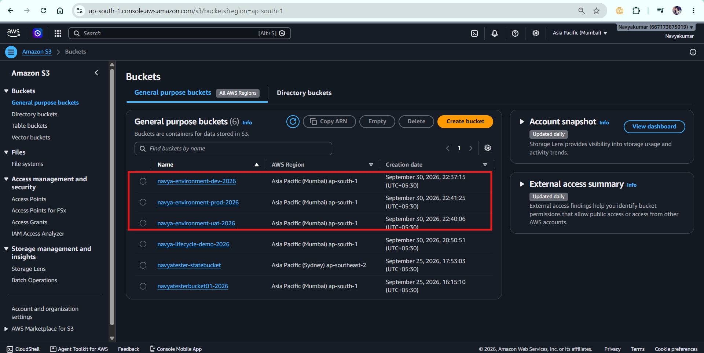
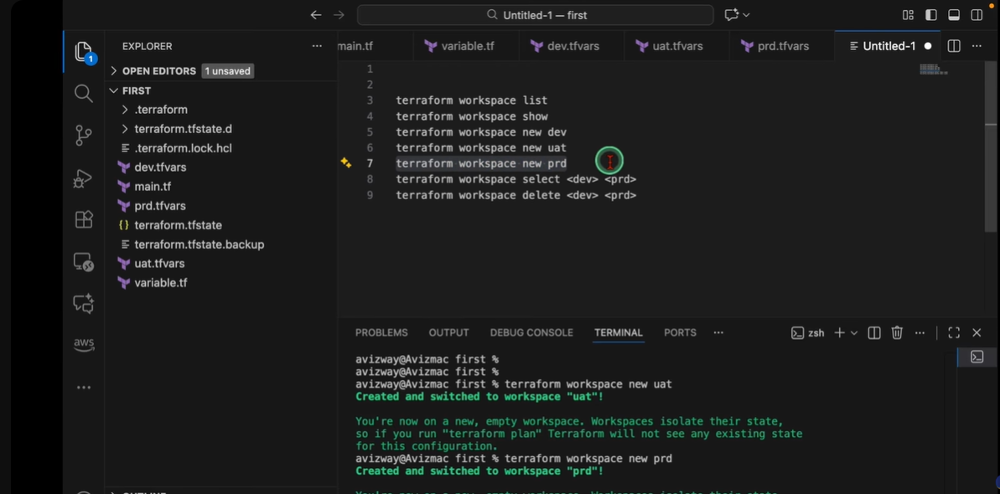

# Terraform Multi-Environment Management using Workspaces

## 1. Project Overview

This project demonstrates how Terraform can manage multiple environments using **Terraform Workspaces**.

The same Terraform configuration is reused for three environments:

* `dev`
* `uat`
* `prod`

Each environment has its own Terraform workspace and separate state.

### Environments

| Environment | Workspace | S3 Bucket                     |
| ----------- | --------- | ----------------------------- |
| Development | `dev`     | `navya-environment-dev-2026`  |
| UAT         | `uat`     | `navya-environment-uat-2026`  |
| Production  | `prod`    | `navya-environment-prod-2026` |

The project uses:

* Terraform
* AWS
* Amazon S3
* Terraform Workspaces
* Terraform Variables
* Terraform Outputs
* `terraform.workspace`

---

# 2. Project Objective

The main objective is to understand how the **same Terraform code can be reused for multiple environments while maintaining separate state**.

This project demonstrates:

1. Creating Terraform workspaces.
2. Creating `dev`, `uat`, and `prod` environments.
3. Switching between environments.
4. Using `terraform.workspace`.
5. Creating environment-specific resource names.
6. Using separate state for each workspace.
7. Verifying each environment independently.
8. Demonstrating environment management to an interviewer.

---

# 3. Architecture

```text
                         Terraform Configuration
                                  |
                 +----------------+----------------+
                 |                |                |
                 v                v                v
               DEV              UAT              PROD
                 |                |                |
                 v                v                v
        S3 Dev Bucket      S3 UAT Bucket     S3 Prod Bucket
                 |                |                |
                 v                v                v
             Dev State        UAT State        Prod State
```

The important concept is:

```text
Same Terraform Code
        |
        +---- dev workspace
        |
        +---- uat workspace
        |
        +---- prod workspace
```

---

# 4. Project Structure

```text
08-environments/
│
├── providers.tf
├── variables.tf
├── main.tf
├── outputs.tf
├── terraform.tfvars
├── .gitignore
└── README.md
```

---

# 5. Terraform Files

## providers.tf

Defines the Terraform version and AWS provider.

```hcl
terraform {
  required_version = ">= 1.14.0, < 2.0.0"

  required_providers {
    aws = {
      source  = "hashicorp/aws"
      version = "~> 6.0"
    }
  }
}

provider "aws" {
  region = var.aws_region
}
```

---

# 6. variables.tf

```hcl
variable "aws_region" {
  description = "AWS region where the environment bucket will be created"
  type        = string
  default     = "ap-south-1"
}

variable "bucket_prefix" {
  description = "Prefix used for environment-specific S3 bucket names"
  type        = string
  default     = "navya-environment"
}
```

---

# 7. main.tf

```hcl
resource "aws_s3_bucket" "environment" {

  # terraform.workspace returns the currently selected
  # Terraform workspace.
  #
  # dev  -> navya-environment-dev-2026
  # uat  -> navya-environment-uat-2026
  # prod -> navya-environment-prod-2026

  bucket = "${var.bucket_prefix}-${terraform.workspace}-2026"

  tags = {
    Name        = "${var.bucket_prefix}-${terraform.workspace}-2026"
    Environment = terraform.workspace
    ManagedBy   = "Terraform"
    Project     = "terraform-environments"
  }
}
```

### Important expression

```hcl
terraform.workspace
```

This returns the currently selected workspace.

For example:

```text
dev  → terraform.workspace = "dev"
uat  → terraform.workspace = "uat"
prod → terraform.workspace = "prod"
```

Therefore:

```hcl
"${var.bucket_prefix}-${terraform.workspace}-2026"
```

produces:

```text
navya-environment-dev-2026
navya-environment-uat-2026
navya-environment-prod-2026
```

---

# 8. outputs.tf

```hcl
output "bucket_name" {
  description = "S3 bucket created for the current environment"

  value = aws_s3_bucket.environment.bucket
}

output "environment" {
  description = "Current Terraform workspace/environment"

  value = terraform.workspace
}

output "bucket_arn" {
  description = "ARN of the environment S3 bucket"

  value = aws_s3_bucket.environment.arn
}
```

---

# 9. terraform.tfvars

```hcl
aws_region = "ap-south-1"

bucket_prefix = "navya-environment"
```

---

# 10. .gitignore

```gitignore
.terraform/

*.tfstate
*.tfstate.*

crash.log
crash.*.log

*.tfplan

terraform.exe

terraform.tfvars
terraform.tfvars.json
```

### Important

Do not add:

```text
.terraform.lock.hcl
```

to `.gitignore`.

The provider lock file should normally be committed to Git.

---

# 11. Terraform Workflow

The basic workflow for this project is:

```text
terraform init
        ↓
terraform validate
        ↓
terraform workspace list
        ↓
create/select workspace
        ↓
terraform plan
        ↓
terraform apply
        ↓
terraform output
        ↓
verify AWS
```

---

# 12. Initialize the Project

From the project directory:

```powershell
terraform fmt -recursive
terraform init
terraform validate
```

Expected validation result:

```text
Success! The configuration is valid.
```

---

# 13. Check Existing Workspaces

```powershell
terraform workspace list
```

Initially:

```text
* default
```

The `*` indicates the currently selected workspace.

---

# 14. Create DEV Environment

Create the workspace:

```powershell
terraform workspace new dev
```

Verify:

```powershell
terraform workspace list
```

Expected:

```text
  default
* dev
```

Check the current workspace:

```powershell
terraform workspace show
```

Expected:

```text
dev
```

Create the infrastructure:

```powershell
terraform plan
terraform apply
```

Enter:

```text
yes
```

Check outputs:

```powershell
terraform output
```

Expected:

```text
environment = "dev"
bucket_name = "navya-environment-dev-2026"
```

---

# 15. Create UAT Environment

Create the workspace:

```powershell
terraform workspace new uat
```

Check:

```powershell
terraform workspace show
```

Expected:

```text
uat
```

Run:

```powershell
terraform plan
```

Terraform should plan the UAT bucket:

```text
navya-environment-uat-2026
```

Apply:

```powershell
terraform apply
```

Then:

```powershell
terraform output
```

Expected:

```text
environment = "uat"
bucket_name = "navya-environment-uat-2026"
```

---

# 16. Create PROD Environment

Create:

```powershell
terraform workspace new prod
```

Verify:

```powershell
terraform workspace show
```

Expected:

```text
prod
```

Run:

```powershell
terraform plan
```

Expected bucket:

```text
navya-environment-prod-2026
```

Apply:

```powershell
terraform apply
```

Then:

```powershell
terraform output
```

Expected:

```text
environment = "prod"
bucket_name = "navya-environment-prod-2026"
```

---

# 17. Final Workspace List

Run:

```powershell
terraform workspace list
```

Expected:

```text
  default
  dev
  uat
* prod
```

The `*` indicates the currently selected workspace.

---

# 18. Switching Between Environments

## Switch to DEV

```powershell
terraform workspace select dev
```

Verify:

```powershell
terraform workspace show
```

Expected:

```text
dev
```

Then:

```powershell
terraform output
```

---

## Switch to UAT

```powershell
terraform workspace select uat
```

Verify:

```powershell
terraform workspace show
```

Expected:

```text
uat
```

Then:

```powershell
terraform output
```

---

## Switch to PROD

```powershell
terraform workspace select prod
```

Verify:

```powershell
terraform workspace show
```

Expected:

```text
prod
```

Then:

```powershell
terraform output
```

---

# 19. Demonstrating Separate State

One of the important interview concepts is that each workspace maintains its own state.

Switch to DEV:

```powershell
terraform workspace select dev
```

Run:

```powershell
terraform state list
```

You should see:

```text
aws_s3_bucket.environment
```

Switch to UAT:

```powershell
terraform workspace select uat
```

Run:

```powershell
terraform state list
```

Again:

```text
aws_s3_bucket.environment
```

The resource address is the same because the Terraform configuration is the same, but the workspace has its own state.

The actual infrastructure represented by that state is different.

---

# 20. AWS Verification

Open:

```text
AWS Console
    ↓
S3
    ↓
Buckets
```

You should see:

```text
navya-environment-dev-2026
navya-environment-uat-2026
navya-environment-prod-2026
```

This proves that the same Terraform configuration created environment-specific infrastructure.

---

# 21. Important Interview Demonstration

If an interviewer asks:

> "Show me how you manage multiple environments using Terraform."

Perform the following live.

### Step 1 — Show workspaces

```powershell
terraform workspace list
```

Show:

```text
default
dev
uat
prod
```

### Step 2 — Select DEV

```powershell
terraform workspace select dev
```

Then:

```powershell
terraform workspace show
```

Show:

```text
dev
```

### Step 3 — Show DEV output

```powershell
terraform output
```

Show:

```text
environment = "dev"
bucket_name = "navya-environment-dev-2026"
```

### Step 4 — Switch to UAT

```powershell
terraform workspace select uat
terraform workspace show
terraform output
```

Show:

```text
uat
```

and:

```text
navya-environment-uat-2026
```

### Step 5 — Switch to PROD

```powershell
terraform workspace select prod
terraform workspace show
terraform output
```

Show:

```text
prod
```

and:

```text
navya-environment-prod-2026
```

### Step 6 — Explain the implementation

Say:

> "I used the same Terraform configuration for all three environments. I used Terraform workspaces to maintain separate state, and `terraform.workspace` to dynamically generate environment-specific bucket names and tags."

---

# 22. Interviewer-Expected Concepts

An interviewer will generally expect you to understand:

### 1. What is an environment?

An environment is an isolated deployment context such as:

```text
Development
UAT
Production
```

Each environment can have different infrastructure, configuration, access controls and deployment requirements.

---

### 2. What is a Terraform workspace?

A workspace allows the same Terraform configuration to be used with separate state instances.

Example:

```text
dev  → Dev state
uat  → UAT state
prod → Prod state
```

---

### 3. What is `terraform.workspace`?

It returns the currently selected workspace name.

Example:

```hcl
Environment = terraform.workspace
```

If the current workspace is `prod`:

```text
Environment = "prod"
```

---

# 23. Interview Questions and Answers

## Q1. What is a Terraform workspace?

**Answer:**

A Terraform workspace allows the same Terraform configuration to be used with separate state instances.

For example, I can use:

```text
dev
uat
prod
```

without creating three completely separate copies of the Terraform code.

---

## Q2. How do you create a workspace?

```powershell
terraform workspace new dev
```

---

## Q3. How do you switch workspaces?

```powershell
terraform workspace select uat
```

---

## Q4. How do you list workspaces?

```powershell
terraform workspace list
```

---

## Q5. How do you check the current workspace?

```powershell
terraform workspace show
```

---

## Q6. What is `terraform.workspace`?

`terraform.workspace` is a Terraform expression that returns the name of the currently selected workspace.

Example:

```hcl
bucket = "${var.bucket_prefix}-${terraform.workspace}-2026"
```

---

## Q7. How did you create different resources using the same code?

I used:

```hcl
terraform.workspace
```

inside the resource configuration.

For example:

```text
dev  → navya-environment-dev-2026
uat  → navya-environment-uat-2026
prod → navya-environment-prod-2026
```

---

## Q8. Does each workspace have separate state?

Yes.

Each workspace has a separate state instance for the same Terraform configuration.

---

## Q9. Does switching workspaces create infrastructure?

No.

Switching a workspace only changes the active workspace/state context.

Infrastructure changes happen when I run commands such as:

```text
terraform plan
terraform apply
```

---

## Q10. Does Terraform create separate `.tf` files for each workspace?

No.

The Terraform configuration remains the same.

The workspace provides a different state context.

---

## Q11. What happens if you run `terraform plan` in DEV?

Terraform evaluates the configuration against the DEV workspace state.

---

## Q12. What happens when you switch to PROD?

Terraform starts using the PROD workspace's state.

It does not automatically apply or modify infrastructure just because you switched.

---

## Q13. Can workspaces provide complete production isolation?

No.

Workspaces provide state separation, but they should not be treated as the only production isolation mechanism.

For stronger isolation, teams may use:

* Separate AWS accounts
* IAM restrictions
* Remote state
* CI/CD approval gates
* Separate deployment pipelines
* Environment-specific access controls

---

## Q14. When would you use workspaces?

Workspaces can be useful when:

* The same configuration is reused.
* Environments have similar infrastructure.
* State needs to be separated.
* The differences between environments are relatively small.

---

## Q15. When might you use separate configurations instead?

For larger or more isolated environments, teams may use separate directories/configurations or separate repositories, particularly when production architecture differs significantly from development.

---

# 24. Scenario-Based Interview Challenges

## Challenge 1 — Developer asks for UAT deployment

**Interviewer:**

> "You are currently in PROD. A developer asks you to deploy a change to UAT. What will you do?"

### Answer

First verify the current workspace:

```powershell
terraform workspace show
```

Then switch:

```powershell
terraform workspace select uat
```

Verify:

```powershell
terraform workspace show
```

Then:

```powershell
terraform plan
```

Review the plan and apply only after confirming the intended changes.

---

# 25. Challenge 2 — How do you avoid accidental PROD changes?

**Answer:**

I would first verify:

```powershell
terraform workspace show
```

Before any production operation.

For stronger production protection, I would use:

* Separate AWS accounts
* Restricted IAM permissions
* CI/CD approval gates
* Remote state
* Controlled production credentials
* Environment-specific pipelines

---

# 26. Challenge 3 — Same code, different environment

**Interviewer:**

> "How does your code know whether it is DEV, UAT or PROD?"

### Answer

The currently selected workspace is available through:

```hcl
terraform.workspace
```

For example:

```hcl
Environment = terraform.workspace
```

Therefore:

```text
dev  → Environment = dev
uat  → Environment = uat
prod → Environment = prod
```

---

# 27. Challenge 4 — Production state

**Interviewer:**

> "You switched from UAT to PROD. How do you know Terraform is using the PROD state?"

### Answer

I verify:

```powershell
terraform workspace show
```

and confirm:

```text
prod
```

Then I can inspect:

```powershell
terraform state list
```

and:

```powershell
terraform output
```

to verify the resources and outputs associated with the selected workspace.

---

# 28. Challenge 5 — Terraform says it wants to create a resource in PROD

**Interviewer:**

> "You switched to PROD and Terraform suddenly wants to create a resource. What would you do?"

### Answer

I would not immediately apply.

I would investigate:

```powershell
terraform workspace show
terraform state list
terraform plan
```

I would verify whether:

* The correct workspace is selected.
* The resource exists in the AWS account.
* The state is correct.
* The configuration changed.
* The resource was created outside Terraform.
* The state was lost or changed.

Only after understanding the plan would I apply it.

---

# 29. Challenge 6 — Someone manually changes the AWS resource

**Interviewer:**

> "Someone manually changes the DEV bucket tags. What happens?"

Terraform may detect the difference during:

```powershell
terraform plan
```

Terraform compares the configuration, state and real infrastructure and may propose changes to bring the resource back to the desired configuration.

This is one reason Infrastructure as Code helps maintain consistency.

---

# 30. Challenge 7 — Can DEV and PROD use different AWS accounts?

Yes.

For stronger environment isolation, DEV, UAT and PROD can be placed in different AWS accounts.

For example:

```text
DEV  → AWS Account A
UAT  → AWS Account B
PROD → AWS Account C
```

The provider configuration would then be designed to authenticate to the appropriate account.

This is stronger isolation than relying only on workspaces.

---

# 31. Challenge 8 — Why not just copy the Terraform directory three times?

Copying the entire Terraform configuration into:

```text
dev/
uat/
prod/
```

can result in duplicated configuration.

When the same infrastructure structure is required across environments, reusable modules, variables, and/or workspaces can reduce duplication.

The appropriate approach depends on the architecture and team's requirements.

---

# 32. Challenge 9 — What if the production configuration is completely different?

If PROD has significantly different infrastructure, simply using the same workspace-based configuration may not be the best design.

I would consider:

* Separate configurations
* Reusable modules
* Environment-specific variable files
* Separate AWS accounts
* Separate state
* CI/CD controls

---

# 33. Challenge 10 — What happens if you forget to switch from PROD?

This is a potential operational risk.

Before applying changes, I should always verify:

```powershell
terraform workspace show
```

and inspect:

```powershell
terraform plan
```

before:

```powershell
terraform apply
```

Production deployments should additionally have appropriate access controls and approval mechanisms.

---

# 34. Important Commands Cheat Sheet

### List workspaces

```powershell
terraform workspace list
```

### Create workspace

```powershell
terraform workspace new dev
```

### Select workspace

```powershell
terraform workspace select dev
```

### Show current workspace

```powershell
terraform workspace show
```

### Delete workspace

```powershell
terraform workspace delete dev
```

Only delete a workspace when you understand its state and infrastructure implications.

### Check state

```powershell
terraform state list
```

### Check outputs

```powershell
terraform output
```

---

# 35. Expected AWS Result

After completing the project:

```text
S3
│
├── navya-environment-dev-2026
│
├── navya-environment-uat-2026
│
└── navya-environment-prod-2026
```

Each bucket has an environment tag:

```text
Environment = dev
Environment = uat
Environment = prod
```

---

# 36. Screenshot Checklist

Capture the following screenshots for the project.

### Screenshot 1 — Project structure

Show:

```text
08-environments/
├── providers.tf
├── variables.tf
├── main.tf
├── outputs.tf
├── terraform.tfvars
└── .gitignore
```

### Screenshot 2 — Terraform initialization

Show:

```text
terraform init
terraform validate
```

### Screenshot 3 — Workspace list

Show:

```text
terraform workspace list
```

with:

```text
default
dev
uat
prod
```

### Screenshot 4 — DEV

Show:

```text
terraform workspace show
dev
```

and:

```text
terraform output
```

### Screenshot 5 — UAT

Show:

```text
terraform workspace show
uat
```

and:

```text
terraform output
```

### Screenshot 6 — PROD

Show:

```text
terraform workspace show
prod
```

and:

```text
terraform output
```

### Screenshot 7 — AWS S3

Show all three buckets:

```text
navya-environment-dev-2026
navya-environment-uat-2026
navya-environment-prod-2026
```

### Screenshot 8 — Environment switching

Show:

```text
terraform workspace select dev
terraform workspace select uat
terraform workspace select prod
```

This is useful for the interview demonstration.

---

# 37. 30-Second Interview Explanation

> "I created a Terraform multi-environment project using workspaces. I used one Terraform configuration for DEV, UAT and PROD. Each workspace maintains separate state, and I used the `terraform.workspace` expression to dynamically generate environment-specific S3 bucket names and tags. I demonstrated creating the three workspaces, switching between them, checking their outputs and verifying the resulting infrastructure in AWS."

---

# 38. 60-Second Interview Explanation

> "In this project, I wanted to understand how Terraform can manage multiple environments without duplicating the entire Terraform configuration. I created DEV, UAT and PROD workspaces and reused the same S3 resource configuration. The `terraform.workspace` expression identifies the currently selected environment, so the bucket name and Environment tag change automatically. Each workspace has its own state, so Terraform tracks the infrastructure for DEV, UAT and PROD separately. I also practiced switching between workspaces, checking state and outputs, running plans, and verifying the resulting buckets in AWS. For production safety, I would combine workspace usage with appropriate AWS account isolation, IAM restrictions, remote state controls and CI/CD approvals."

---

# 39. Key Concepts to Remember

```text
Workspace
    ↓
Separate state context

terraform.workspace
    ↓
Current workspace name

dev
uat
prod
    ↓
Different environment values

Same Terraform code
    ↓
Multiple environments
```

### Easy interview memory

```text
workspace new
      ↓
Create

workspace select
      ↓
Switch

workspace show
      ↓
Check current

workspace list
      ↓
List all

terraform.workspace
      ↓
Use current environment inside code
```

---

# 40. Project Outcome

After completing this project, I can demonstrate:

* Terraform multi-environment management.
* Terraform Workspaces.
* DEV/UAT/PROD separation at the state level.
* Workspace switching.
* `terraform.workspace`.
* Variables.
* Outputs.
* AWS resource creation.
* Environment-specific naming.
* Terraform state inspection.
* Infrastructure verification.
* Production safety considerations.

This project provides hands-on understanding of managing multiple environments using Terraform while reusing a common configuration.

