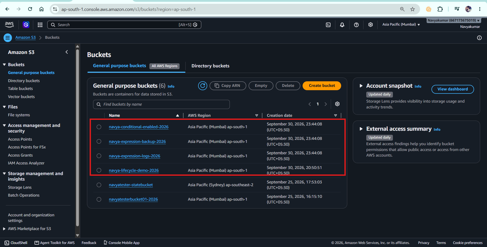
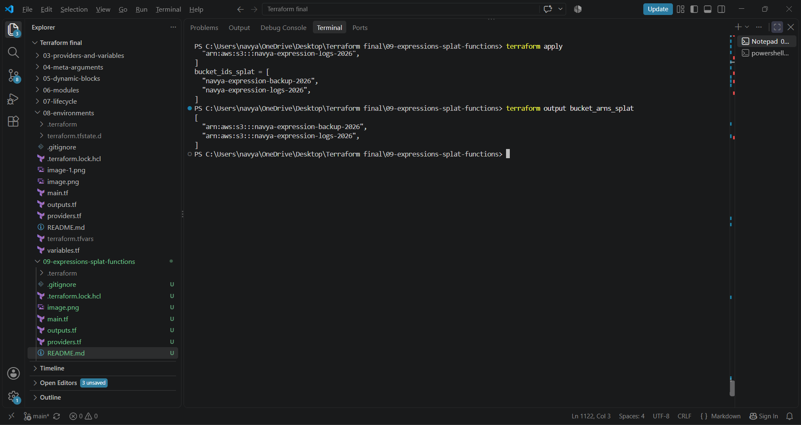

# 09 - Terraform Expressions, Splat Expressions & Functions

## 📌 Project Overview

This project demonstrates important Terraform concepts used to create dynamic and reusable infrastructure:

* Terraform Expressions
* Conditional Expressions
* `for` Expressions
* Splat Expressions
* Terraform Built-in Functions
* `for_each`
* `toset()`
* `values()`
* Local Values
* Input Variables
* Output Values

For this project, I created multiple Amazon S3 buckets using Terraform and used expressions and functions to dynamically generate values, names, conditions, and outputs.

---

# 🎯 Project Objective

The main objective of this project is to understand how Terraform can calculate and transform values instead of hardcoding everything.

The project demonstrates:

```text
Input Variables
      ↓
Expressions
      ↓
Functions / Locals
      ↓
Resources
      ↓
For Expressions / Splat
      ↓
Outputs
```

---

# 🏗️ Project Architecture

```text
                    Terraform
                        │
                        ▼
                Input Variables
                        │
          ┌─────────────┼─────────────┐
          ▼             ▼             ▼
      Functions    Expressions     Conditional
          │             │             │
          └─────────────┼─────────────┘
                        ▼
                  Local Values
                        │
                        ▼
                  S3 Resources
                 ┌──────┼──────┐
                 ▼      ▼      ▼
               Logs   Backup Conditional
                 │      │      │
                 └──────┼──────┘
                        ▼
                 Terraform Outputs
                        │
             ┌──────────┴──────────┐
             ▼                     ▼
         For Expression       Splat Expression
```

---

# 📁 Project Structure

```text
09-expressions-splat-functions/
│
├── providers.tf
├── variables.tf
├── main.tf
├── outputs.tf
├── terraform.tfvars
├── .gitignore
└── README.md
```

---

# 📄 File Explanation

## 1. providers.tf

This file defines the Terraform version and AWS provider.

```hcl
terraform {
  required_version = ">= 1.14.0, < 2.0.0"

  required_providers {
    aws = {
      source  = "hashicorp/aws"
      version = "~> 6.0"
    }
  }
}

provider "aws" {
  region = var.aws_region
}
```

### What I demonstrate to the interviewer

I can explain:

> "I have specified both the Terraform version constraint and AWS provider version constraint. The AWS region is taken from an input variable instead of hardcoding it directly in the provider."

---

# 📄 2. variables.tf

```hcl
variable "aws_region" {
  description = "AWS region for the project"
  type        = string
  default     = "ap-south-1"
}

variable "environment" {
  description = "Environment name"
  type        = string
  default     = "dev"
}

variable "project_name" {
  description = "Project name"
  type        = string
  default     = "Navya Terraform"
}

variable "bucket_names" {
  description = "List of bucket names"
  type        = list(string)
}

variable "environment_enabled" {
  description = "Whether the environment is enabled"
  type        = bool
  default     = true
}

variable "bucket_config" {
  description = "Map containing bucket configuration"
  type        = map(string)

  default = {
    logs   = "logs"
    backup = "backup"
  }
}
```

### Interview explanation

> "I use different variable types here, including string, list, bool, and map. This allows the configuration to be dynamic instead of hardcoding values directly into resources."

---

# 📄 3. terraform.tfvars

```hcl
aws_region = "ap-south-1"

environment = "dev"

project_name = "Navya Terraform"

bucket_names = [
  "navya-expression-logs-2026",
  "navya-expression-backup-2026"
]

environment_enabled = true

bucket_config = {
  logs   = "logs"
  backup = "backup"
}
```

The actual values are kept separately from the variable declarations.

---

# 📄 4. main.tf

## Local Values

```hcl
locals {
  normalized_environment = lower(var.environment)

  environment_label = upper(var.environment)

  project_identifier = join(
    "-",
    [
      "navya",
      lower(var.environment),
      "terraform"
    ]
  )

  bucket_count = length(var.bucket_names)

  deployment_status = var.environment_enabled ? "enabled" : "disabled"

  is_dev_environment = contains(
    ["dev", "uat"],
    lower(var.environment)
  )
}
```

---

# 🧠 Functions Demonstrated

## `lower()`

```hcl
lower(var.environment)
```

If:

```text
DEV
```

Then:

```text
dev
```

### Why?

To normalize values and avoid problems caused by uppercase/lowercase differences.

---

## `upper()`

```hcl
upper(var.environment)
```

Example:

```text
dev → DEV
```

---

## `length()`

```hcl
length(var.bucket_names)
```

If there are two bucket names:

```text
2
```

This allows Terraform to calculate the number dynamically.

---

## `join()`

```hcl
join("-", ["navya", "dev", "terraform"])
```

Result:

```text
navya-dev-terraform
```

This is useful when dynamically creating names.

---

## `contains()`

```hcl
contains(["dev", "uat"], lower(var.environment))
```

If environment is:

```text
dev
```

Result:

```text
true
```

If environment is:

```text
prod
```

Result:

```text
false
```

---

# 🔀 Conditional Expression

The project uses:

```hcl
deployment_status = var.environment_enabled ? "enabled" : "disabled"
```

This follows:

```text
condition ? true_value : false_value
```

For example:

```text
environment_enabled = true
```

produces:

```text
enabled
```

If:

```text
environment_enabled = false
```

produces:

```text
disabled
```

---

# 🪣 Creating Multiple S3 Buckets

```hcl
resource "aws_s3_bucket" "demo" {
  for_each = toset(var.bucket_names)

  bucket = each.value

  tags = {
    Name        = each.value
    Environment = local.normalized_environment
    Project     = "terraform-expressions"
    ManagedBy   = "Terraform"
  }
}
```

The input contains:

```text
navya-expression-logs-2026
navya-expression-backup-2026
```

Terraform creates:

```text
Bucket 1 → navya-expression-logs-2026
Bucket 2 → navya-expression-backup-2026
```

---

# 🔄 Why `toset()`?

`for_each` works well with sets or maps.

Therefore:

```hcl
for_each = toset(var.bucket_names)
```

converts the list into a set.

This also helps avoid duplicate values.

---

# 🔀 Conditional S3 Bucket

```hcl
resource "aws_s3_bucket" "conditional" {
  bucket = var.environment_enabled ? "navya-conditional-enabled-2026" : "navya-conditional-disabled-2026"

  tags = {
    Name        = "Conditional Bucket"
    Environment = var.environment
    Status      = local.deployment_status
    ManagedBy   = "Terraform"
  }
}
```

Because:

```hcl
environment_enabled = true
```

Terraform creates:

```text
navya-conditional-enabled-2026
```

---

# 🔎 For Expression

In `outputs.tf`:

```hcl
output "bucket_names" {
  description = "Names of all S3 buckets"

  value = [
    for bucket in aws_s3_bucket.demo :
    bucket.bucket
  ]
}
```

This means:

> "Iterate through all bucket resources and return the bucket name."

Conceptually:

```text
Resource collection
       ↓
for bucket in collection
       ↓
bucket.bucket
       ↓
List of bucket names
```

---

# ⭐ Splat Expression

The project demonstrates splat expressions using:

```hcl
values(aws_s3_bucket.demo)[*].arn
```

### Why `values()`?

Because the resource uses:

```hcl
for_each
```

and therefore Terraform represents the resource instances as a map.

So we first convert the map values into a list:

```hcl
values(aws_s3_bucket.demo)
```

Then apply the splat:

```hcl
[*].arn
```

Complete expression:

```hcl
values(aws_s3_bucket.demo)[*].arn
```

This returns the ARN of every bucket.

---

# 📄 outputs.tf

Important outputs include:

```hcl
output "bucket_names" {
  description = "Names of all S3 buckets"

  value = [
    for bucket in aws_s3_bucket.demo :
    bucket.bucket
  ]
}

output "bucket_arns_splat" {
  description = "ARNs of all buckets using a splat expression"

  value = values(aws_s3_bucket.demo)[*].arn
}

output "bucket_ids_splat" {
  description = "IDs of all buckets using a splat expression"

  value = values(aws_s3_bucket.demo)[*].id
}

output "bucket_count" {
  description = "Number of buckets"

  value = local.bucket_count
}

output "normalized_environment" {
  description = "Environment converted to lowercase"

  value = local.normalized_environment
}

output "environment_label" {
  description = "Environment converted to uppercase"

  value = local.environment_label
}

output "project_identifier" {
  description = "Project identifier"

  value = local.project_identifier
}

output "deployment_status" {
  description = "Deployment status"

  value = local.deployment_status
}

output "is_dev_or_uat" {
  description = "Whether environment is dev or uat"

  value = local.is_dev_environment
}

output "bucket_configuration_keys" {
  description = "Keys from bucket configuration map"

  value = keys(var.bucket_config)
}

output "bucket_configuration_values" {
  description = "Values from bucket configuration map"

  value = values(var.bucket_config)
}
```

---

# 🚀 Terraform Workflow

## Step 1 — Format

```powershell
terraform fmt
```

Purpose:

> Formats Terraform configuration according to Terraform's standard formatting.

---

## Step 2 — Initialize

```powershell
terraform init
```

Purpose:

> Downloads and initializes the required providers.

---

## Step 3 — Validate

```powershell
terraform validate
```

Expected:

```text
Success! The configuration is valid.
```

---

## Step 4 — Plan

```powershell
terraform plan
```

This shows what Terraform intends to create/change/destroy without actually creating resources.

For this project:

```text
Plan: 3 to add, 0 to change, 0 to destroy.
```

---

## Step 5 — Apply

```powershell
terraform apply
```

Type:

```text
yes
```

Terraform creates the infrastructure.

---

## Step 6 — Check Outputs

```powershell
terraform output
```

Individual output:

```powershell
terraform output bucket_arns_splat
```

---

# 🎤 INTERVIEWER EXPECTED PROJECT DEMONSTRATION

If the interviewer says:

> "Can you demonstrate your Terraform project?"

Follow this order.

### 1. Show the project structure

```text
09-expressions-splat-functions
```

Explain:

> "I have separated provider configuration, variables, resources, outputs and variable values into different Terraform files."

---

### 2. Show variables

Open:

```text
variables.tf
```

Explain:

> "I have used string, list, boolean and map variable types."

---

### 3. Show functions

Open:

```text
main.tf
```

Show:

```hcl
lower()
upper()
length()
join()
contains()
```

Say:

> "These functions dynamically transform or evaluate values instead of hardcoding them."

---

### 4. Show conditional expression

Show:

```hcl
var.environment_enabled ? "enabled" : "disabled"
```

Explain:

> "This is a conditional expression. If the variable is true, Terraform uses the first value; otherwise it uses the second."

---

### 5. Show `for_each`

Show:

```hcl
for_each = toset(var.bucket_names)
```

Explain:

> "I use for_each to create one S3 bucket for every unique bucket name."

---

### 6. Show `for` expression

Show:

```hcl
[
  for bucket in aws_s3_bucket.demo :
  bucket.bucket
]
```

Explain:

> "This iterates over the resource collection and extracts the bucket names."

---

### 7. Show splat

Show:

```hcl
values(aws_s3_bucket.demo)[*].arn
```

Explain:

> "Because for_each creates a map, I first use values() to get the resource instances as a list, and then use the splat operator to retrieve the ARN from every instance."

---

### 8. Run Terraform

```powershell
terraform validate
terraform plan
terraform apply
```

Then:

```powershell
terraform output
```

---

### 9. Show AWS

Open AWS S3 and demonstrate the three created buckets:

```text
navya-expression-logs-2026
navya-expression-backup-2026
navya-conditional-enabled-2026
```

---

# 🧪 CHALLENGES I FACED

## Challenge 1 — Conditional expression syntax

Initially the conditional expression was written across multiple lines:

```hcl
bucket = var.environment_enabled
  ? "enabled"
  : "disabled"
```

Terraform produced a syntax error.

I corrected it to:

```hcl
bucket = var.environment_enabled ? "enabled" : "disabled"
```

### What I learned

Terraform conditional expressions need to be structured correctly as:

```text
condition ? true_value : false_value
```

---

# Challenge 2 — Variables not declared

Terraform initially showed:

```text
Reference to undeclared input variable
```

### Cause

The configuration referenced variables such as:

```hcl
var.environment
var.bucket_names
var.aws_region
```

but Terraform could not find their declarations.

### Solution

I created/updated:

```text
variables.tf
```

with the required variable blocks.

### Learning

Terraform automatically loads `.tf` files from the same working directory.

---

# Challenge 3 — Splat with `for_each`

Initially I used:

```hcl
aws_s3_bucket.demo[*].arn
```

Terraform produced an error because the resource was created using:

```hcl
for_each
```

### Solution

I changed it to:

```hcl
values(aws_s3_bucket.demo)[*].arn
```

### Learning

`for_each` creates a map of resource instances, so `values()` can be used to obtain the resource instances before applying the splat expression.

---

# 🧠 INTERVIEW QUESTIONS & ANSWERS

## Q1. What is a Terraform expression?

**Answer:**

> An expression is a Terraform construct that evaluates to a value. It can use literals, variables, resource attributes, operators, functions and other expressions.

Example:

```hcl
var.environment == "prod"
```

---

## Q2. What is a Terraform function?

**Answer:**

> A function is a built-in Terraform operation that accepts input values and returns a transformed or calculated value.

Example:

```hcl
lower(var.environment)
```

---

## Q3. What is a conditional expression?

**Answer:**

> A conditional expression selects one of two values based on a condition.

Syntax:

```hcl
condition ? true_value : false_value
```

Example:

```hcl
var.environment == "prod" ? "production" : "non-production"
```

---

## Q4. What is a splat expression?

**Answer:**

> A splat expression is a concise way to retrieve the same attribute from multiple elements of a collection.

Example:

```hcl
list[*].attribute
```

---

## Q5. What does `[*]` mean?

**Answer:**

> `[*]` means iterate over all elements of a list-like collection and retrieve the specified attribute from each element.

Example:

```hcl
aws_instance.web[*].id
```

---

## Q6. What is the difference between `for` and splat?

**Answer:**

> Splat is useful when I want the same attribute from every element. A `for` expression is more flexible because I can transform, filter or construct a different output.

Splat:

```hcl
values(aws_s3_bucket.demo)[*].arn
```

For:

```hcl
[
  for bucket in aws_s3_bucket.demo :
  bucket.bucket
]
```

---

## Q7. Why did you use `values()` before the splat?

**Answer:**

> Because my S3 resource uses `for_each`, Terraform represents the instances as a map. I use `values()` to get the resource instances from the map, then apply the splat expression.

```hcl
values(aws_s3_bucket.demo)[*].arn
```

---

## Q8. Why did you use `toset()`?

**Answer:**

> I used `toset()` to convert my list of bucket names into a set so it can be used with `for_each`. A set also removes duplicate values.

```hcl
for_each = toset(var.bucket_names)
```

---

## Q9. What does `length()` do?

**Answer:**

> `length()` returns the number of elements in a collection or the number of characters in a string.

Example:

```hcl
length(var.bucket_names)
```

returns the number of bucket names.

---

## Q10. What does `lower()` do?

**Answer:**

> It converts a string to lowercase.

```hcl
lower("DEV")
```

Result:

```text
dev
```

---

## Q11. Why would you use `lower()` in real infrastructure?

**Answer:**

> To normalize values before using them in resource names, tags or comparisons. This helps avoid inconsistencies such as `DEV`, `Dev` and `dev`.

---

## Q12. What does `join()` do?

**Answer:**

> `join()` combines elements of a list into a single string using a delimiter.

Example:

```hcl
join("-", ["navya", "dev", "terraform"])
```

Result:

```text
navya-dev-terraform
```

---

## Q13. What does `contains()` do?

**Answer:**

> It checks whether a collection contains a particular

  